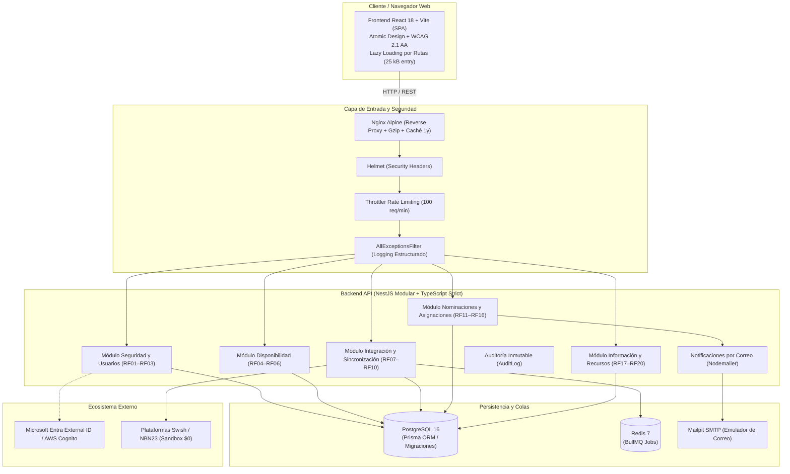

# SGAOB — Sistema de Gestión de Árbitros y Oficiales de Básquetbol


-blue)


Plataforma integral web para la digitalización, sincronización y optimización operativa de la gestión de árbitros y oficiales de mesa en el básquetbol chileno.

**Proyecto Capstone de Ingeniería en Informática — Escuela de Informática y Telecomunicaciones, Duoc UC.**

---

## 1. Diagrama de Arquitectura del Sistema



---

## 2. Módulos y Requerimientos Funcionales (RF01 - RF20)

| Módulo | Casos de Uso | Requerimientos | Capacidades Principales |
|---|---|---|---|
| **1. Seguridad y Usuarios** | CU-01, CU-02 | **RF01, RF02, RF03** | Autenticación agnóstica (Cognito / Entra / JWT), registro formal de consentimiento de datos personales con IP/timestamp, gestión de perfiles y estados de cuenta (`ACTIVE`, `INACTIVE`, `PENDING_ROLE`), y **separación estricta de roles técnicos (Árbitro vs Oficial de Mesa, Anexo A.1)**. |
| **2. Disponibilidad** | CU-03, CU-04 | **RF04, RF05, RF06** | Declaración masiva semanal por bloques (`HORARIO_1`, `HORARIO_2`, `FULL`, `NO`), validación automática de regla de cierre (Miércoles 23:59), bloques parametrizados según día hábil o fin de semana (**Anexo A.4**) y consolidado administrativo para la Comisión Técnica. |
| **3. Integración y Sincronización** | CU-05, CU-06 | **RF07, RF08, RF09, RF10** | Cartelera unificada de partidos, creación manual autónoma, prueba de conectividad y sincronización asíncrona mediante **BullMQ y Redis** contra Swish y NBN23 (entorno Sandbox sin costo), y detección de reprogramaciones con alerta automática al personal designado (**RF10**). |
| **4. Nominaciones y Asignaciones** | CU-07, CU-08 | **RF11, RF12, RF13, RF14, RF15, RF16** | Cruce algorítmico inteligente (filtro por disponibilidad declarada, topes de horario y exclusión estricta de roles incorrectos), soporte para **modalidad de 3 árbitros (Anexo A.2)**, alertas por correo, confirmación o rechazo justificado y grilla interactiva de visualización. |
| **5. Información y Recursos** | CU-09, CU-10 | **RF17, RF18, RF19, RF20** | Repositorio oficial de bases y reglamentos FIBA en PDF (**RF17**), **Bóveda segura de credenciales API forzando visibilidad ADMIN (Anexo A.5)** con enmascaramiento UI (**RF18**), tablón de comunicados en vivo (**RF19**) y **exportación oficial de asignaciones en formato CSV con BOM UTF-8 para Microsoft Excel (RF20)**. |

---

## 3. Estructura del Monorepo

```text
.
├── apps/
│   ├── api/                     # Backend NestJS (TypeScript Strict)
│   │   ├── prisma/              # Esquema relacional, migraciones versionadas y seeds
│   │   ├── src/                 # Controladores, servicios, DTOs, guards y exception filters
│   │   ├── test/                # Pruebas e2e (app.e2e-spec.ts y pilot-validation.e2e-spec.ts)
│   │   └── Dockerfile           # Imagen Docker multi-stage de producción (node:20-alpine)
│   └── web/                     # Frontend React 18 + Vite (SPA)
│       ├── src/                 # Componentes modulares, hooks, páginas lazy y cliente API
│       ├── nginx.conf           # Configuración Nginx con gzip, caché estática y proxy
│       └── Dockerfile           # Imagen Docker multi-stage de producción (nginx:alpine)
├── packages/
│   └── shared/                  # Contratos de dominio, enums y tipos compartidos
├── docs/                        # Informes de avance PR1–PR16 y manuales técnicos
├── docker-compose.yml           # Infraestructura local (Postgres, Redis, Mailpit)
├── docker-compose.prod.yml      # Pila de producción completa (Web, API, BD, Redis, Mailpit)
├── AGENTS.md                    # Protocolo de calidad, ingeniería y reglas pre-commit
└── README.md                    # Documentación principal del repositorio
```

---

## 4. Puesta en Marcha

### Prerrequisitos
- **Node.js:** `>= 20.x`
- **npm:** `>= 10.x`
- **Docker & Docker Compose**

---

### Opción A: Modo Desarrollo Rápido (Recomendado para desarrollo local)

1. **Clonar e instalar dependencias del monorepo:**
   ```bash
   git clone https://github.com/MartinTCorrea/proyectocapstone.git
   cd proyectocapstone
   npm install
   ```

2. **Configurar el entorno:**
   ```bash
   cp .env.example .env
   ```

3. **Iniciar los servicios base en Docker:**
   ```bash
   docker compose up -d
   ```
   *Servicios levantados: PostgreSQL (5432), Redis (6379), Mailpit SMTP (1025) y Web UI (8025).*

4. **Compilar la librería compartida:**
   ```bash
   npm run build --prefix packages/shared
   ```

5. **Aplicar migraciones de base de datos:**
   ```bash
   npm run prisma:migrate --prefix apps/api
   ```

6. **Iniciar el Backend (NestJS):**
   ```bash
   npm run start:dev --prefix apps/api
   ```
   - API REST: `http://localhost:3000/api`
   - Documentación Interactiva Swagger: `http://localhost:3000/api/docs`

7. **Iniciar el Frontend (React + Vite):**
   ```bash
   npm run dev --prefix apps/web
   ```
   - Interfaz Web: `http://localhost:5173`

---

### Opción B: Despliegue de Producción 100% Contenerizado

Para desplegar la aplicación completa (Frontend Nginx + Backend NestJS + PostgreSQL + Redis + Mailpit) en un solo comando:

```bash
docker compose -f docker-compose.prod.yml up --build -d
```
- **Frontend SPA (Nginx):** `http://localhost` (puerto 80)
- **Backend API:** `http://localhost:3000/api`
- **Swagger Docs:** `http://localhost:3000/api/docs`
- **Mailpit Web UI:** `http://localhost:8025`

---

## 5. Credenciales de Prueba y Selector de Roles

La aplicación incluye un componente interactivo (**DevAuthSwitcher**) que permite autenticarse instantáneamente sin depender de servicios externos de identidad:

| Perfil de Prueba | Correo Electrónico | Rol Asignado | Capacidades |
|---|---|---|---|
| **Comisión Técnica (Admin)** | `admin.comision@sgaob.cl` | `ADMIN_COMISION_TECNICA` | Gestión completa de usuarios, creación de partidos, cruce de ternas, bóveda de credenciales y exportación a Excel. |
| **Árbitro Principal** | `arbitro.principal@sgaob.cl` | `ARBITRO` | Declaración de disponibilidad, recepción y confirmación/rechazo de designaciones arbitrales, descarga de reglamentos. |
| **Árbitro Secundario** | `arbitro.asistente@sgaob.cl` | `ARBITRO` | Declaración horaria, respuesta a nominaciones de slot Árbitro 1 o 2. |
| **Oficial de Mesa** | `oficial.mesa@sgaob.cl` | `OFICIAL_MESA` | Declaración horaria, asignación exclusiva a puestos de mesa técnica (Anotador, Cronometrador, 24 seg). |

---

## 6. Aseguramiento de Calidad y Pruebas Automatizadas

El proyecto cuenta con un total de **184 pruebas automatizadas aprobadas al 100%**:

### 1. Pruebas Unitarias del Backend (121 tests en 17 suites)
```bash
npm run test --prefix apps/api
```
*Cubre toda la lógica de negocio: cruce de disponibilidad, cálculo de bloques por tipo de día, separación de roles, notificaciones, filtros de excepciones y auditoría.*

### 2. Pruebas de Integración y Simulación Piloto E2E (63 tests en 2 suites)
```bash
npm run test:e2e --prefix apps/api
```
*Ejecuta contra PostgreSQL la suite base y la simulación piloto del ciclo completo de un torneo (CU-01 a CU-10).*

### 3. Verificación Estricta de Tipos y Linters (0 errores)
```bash
npx tsc --noEmit -p apps/api/tsconfig.json
npm run lint --prefix apps/web
```

### 4. Compilación Global del Monorepo
```bash
npm run build
```

---

## 7. Documentación Técnica del Proyecto

En el directorio [`/docs`](file:///c:/Users/mella/OneDrive/Documentos/Proyectos/CapstoneMain/docs) se encuentran los informes detallados de cada hito:

- [`docs/informe-final-capstone.md`](file:///c:/Users/mella/OneDrive/Documentos/Proyectos/CapstoneMain/docs/informe-final-capstone.md): **Informe Académico Final de Cierre**.
- [`docs/avance-pr15.md`](file:///c:/Users/mella/OneDrive/Documentos/Proyectos/CapstoneMain/docs/avance-pr15.md): Reporte de la Validación Piloto E2E (Fases 1 a 6).
- [`docs/avance-pr16.md`](file:///c:/Users/mella/OneDrive/Documentos/Proyectos/CapstoneMain/docs/avance-pr16.md): Reporte de Optimización, Code Splitting y Dockerfiles.
- [`docs/arquitectura-estilos-frontend.md`](file:///c:/Users/mella/OneDrive/Documentos/Proyectos/CapstoneMain/docs/arquitectura-estilos-frontend.md): Guía de diseño modular de interfaces.
- Informes de avance progresivo: `avance-pr1-pr2.md` a `avance-pr14.md`.

---

## 8. Equipo de Desarrollo (Duoc UC)

- **Esteban Fuentes**
- **Javier Sanchez**
- **Martín Troncoso**
