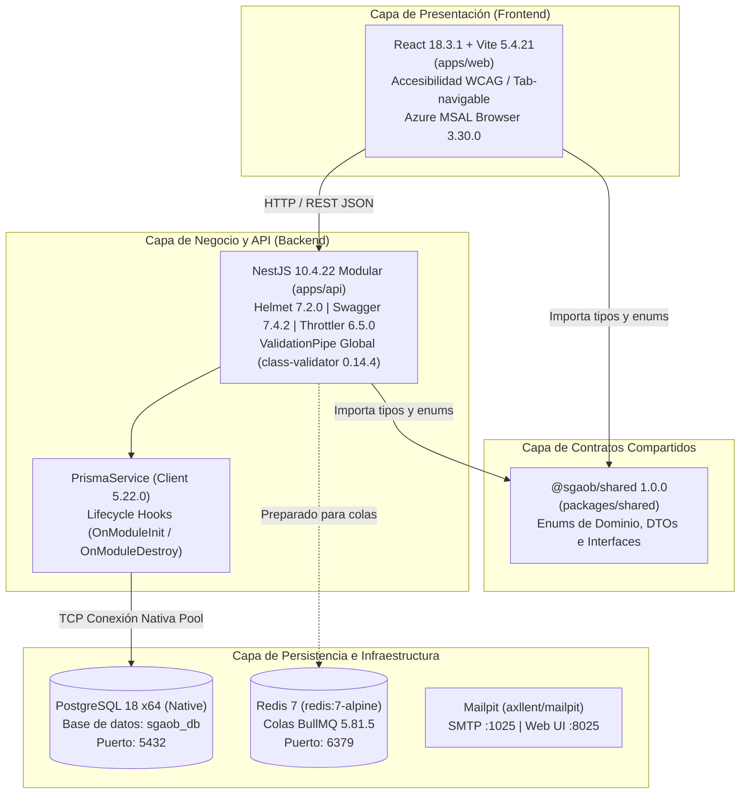

# SGAOB — Documento de Avance de Proyecto: PR1 y PR2
**Sistema de Gestión de Árbitros y Oficiales de Básquetbol**  
**Proyecto Capstone — Ingeniería en Informática, Duoc UC**  
**Hito:** Scaffolding, Esquema de Persistencia y Configuración de Entorno Base  
**Fecha de corte:** Septiembre 2026  
**Equipo de desarrollo:** SGAOB Team  

---

## 1. Resumen Ejecutivo

El presente informe consolida el avance técnico alcanzado durante la ejecución de los dos primeros Pull Requests (**PR1** y **PR2**) del proyecto **SGAOB**. El objetivo central de esta etapa consistió en establecer la base arquitectónica, el repositorio monorepo, la cadena de herramientas de desarrollo (*toolchain*), el modelo entidad-relación relacional en PostgreSQL mediante Prisma ORM, la migración inicial inmutable, la siembra (*seed*) de datos maestros y la verificación operativa del entorno de ejecución.

### Alcance Real Ejecutado
- **PR1 (`setup(repo)`):** Creación del monorepo con `npm workspaces` integrando tres paquetes principales: backend modular ([`apps/api`](file:///c:/Users/mella/OneDrive/Documentos/Proyectos/CapstoneMain/apps/api)), cliente web ([`apps/web`](file:///c:/Users/mella/OneDrive/Documentos/Proyectos/CapstoneMain/apps/web)) y biblioteca de contratos compartidos ([`packages/shared`](file:///c:/Users/mella/OneDrive/Documentos/Proyectos/CapstoneMain/packages/shared)). Configuración de TypeScript estricto, Prettier, `.gitignore`, `.env.example` e infraestructura local con Docker Compose.
- **PR2 (`setup(api)`):** Definición formal del esquema relacional completo en [`apps/api/prisma/schema.prisma`](file:///c:/Users/mella/OneDrive/Documentos/Proyectos/CapstoneMain/apps/api/prisma/schema.prisma), generación de la migración versionada `20260911000000_init_schema`, ejecución del script de seed con los 3 roles de negocio y los 4 bloques horarios paramétricos (según Anexo A.4), integración del servicio singleton `PrismaService` en el ciclo de vida de NestJS y verificación en vivo contra base de datos real PostgreSQL 18.
- **Ajustes de Estabilidad:** Resolución del conflicto de variables de entorno de Prisma mediante consolidación en archivo `.env` raíz y configuración de compilación de producción en `tsconfig.build.json`.

---

## 2. Arquitectura Implementada

Se adoptó una arquitectura cliente-servidor desacoplada estructurada como monorepo, orientada a mantener contratos de datos homogéneos de extremo a extremo (*end-to-end type safety*).



### Versiones Exactas del Stack Instalado en el Entorno Real

| Componente | Tecnología | Versión Instalada | Rol en el Proyecto |
|---|---|---|---|
| **Runtime** | Node.js | `v24.19.0` | Entorno de ejecución JavaScript del servidor |
| **Package Manager** | npm | `12.0.2` | Gestor de paquetes y orquestador de workspaces |
| **Lenguaje Base** | TypeScript | `5.9.3` | Tipado estático estricto en frontend, backend y shared |
| **Backend Framework** | NestJS Core / Common | `10.4.22` | Framework modular para la arquitectura de la API REST |
| **Documentación API** | `@nestjs/swagger` | `7.4.2` | Autogeneración de especificación OpenAPI 3.0 |
| **Seguridad HTTP** | Helmet | `7.2.0` | Inyección de cabeceras de protección HTTP |
| **Validación de Datos** | class-validator / transformer | `0.14.4` / `0.5.1` | Validación de DTOs en tiempo de ejecución |
| **ORM / Acceso a Datos**| Prisma ORM & Client | `5.22.0` | Mapeo objeto-relacional y migraciones declarativas |
| **Base de Datos** | PostgreSQL (Windows x64) | `18.0` (Servicio activo) | Motor de base de datos relacional principal |
| **Colas de Tareas** | BullMQ / ioredis | `5.81.5` / `5.11.1` | Gestión de colas asíncronas para sincronización |
| **Frontend Framework** | React / React DOM | `18.3.1` | Biblioteca de interfaz de usuario de componentes |
| **Frontend Tooling** | Vite | `5.4.21` | Bundler y servidor de desarrollo ultrarrápido |
| **Enrutamiento Web** | React Router DOM | `6.30.6` | Enrutamiento declarativo del Single Page Application |
| **Auth Cliente** | `@azure/msal-browser` | `3.30.0` | Integración cliente con Microsoft Entra External ID |
| **Iconografía** | Lucide React | `0.439.0` | Componentes visuales accesibles |
| **Infraestructura Local**| Docker Compose | `3.8 (compose.yml)` | Receta de contenedores (Postgres 16, Redis 7, Mailpit) |

---

## 3. Decisiones de Diseño y su Justificación

En esta sección se detallan las decisiones estructurales adoptadas, contrastando lo implementado en esta etapa frente a lo planificado para hitos posteriores:

### 3.1 Arquitectura Monorepo (`npm workspaces`)
- **Estado:** **Implementada.**
- **Justificación:** SGAOB cuenta con reglas de negocio estrictas (`MatchRole`, `AvailabilityBlock`, `MatchTimeBlock`, `AuditAction`). Implementar un monorepo con un paquete común ([`@sgaob/shared`](file:///c:/Users/mella/OneDrive/Documentos/Proyectos/CapstoneMain/packages/shared)) elimina la duplicación de tipos entre React y NestJS, previene inconsistencias durante el ciclo de vida del desarrollo y facilita la colaboración coordinada de un equipo de 3 desarrolladores sin costo adicional de herramientas de terceros (dentro del presupuesto de USD 235).

### 3.2 Selección de ORM: Prisma
- **Estado:** **Implementada.**
- **Justificación:** Cumple la directriz mandatoria de calidad de `AGENTS.md` (*"Migraciones de base de datos versionadas, nunca synchronize: true"*). Prisma provee seguridad de tipos end-to-end, un archivo de definición unificado (`schema.prisma`) altamente legible para evaluación académica, e inspección visual de datos con Prisma Studio sin requerir licencias de software comercial.

### 3.3 Autenticación Delegada: Microsoft Entra External ID
- **Estado:** **Planificada / Preparada.**
- **Justificación:** Se delegará la gestión de credenciales (correo/contraseña) al servicio CIAM oficial de Microsoft, cumpliendo RF01 sin almacenar contraseñas en la base de datos local. En PR1/PR2 se instalaron las dependencias del backend (`passport`, `passport-jwt`, `jwks-rsa`) y frontend (`@azure/msal-browser`, `@azure/msal-react`) y se modeló el campo `external_id` en `User`. La estrategia de validación de tokens JWKS se implementará en PR3.

### 3.4 Abstracción de Proveedores de Integración (`MatchSyncProvider`)
- **Estado:** **Planificada (Módulo 3).**
- **Justificación:** El sistema dependerá de APIs de terceros (NBN23 y Swish). Dado que el acceso formal a dichas APIs puede demorarse, la arquitectura prevé una interfaz desacoplada que permitirá alternar entre un proveedor real y un proveedor mock mediante la variable `SYNC_PROVIDER=mock`, garantizando la verificabilidad del sistema para efectos de la evaluación académica.

### 3.5 Desviaciones Técnicas Justificadas respecto a la Planificación Inicial

| Aspecto | Planificación Inicial | Implementación Real en PR1/PR2 | Justificación Técnica |
|---|---|---|---|
| **Unicidad de Partido (`Match`)** | Unicidad simple global en `external_id` | Unicidad compuesta `@@unique([platform, externalId])` | NBN23 y Swish son plataformas independientes cuyos identificadores numéricos pueden colisionar entre sí. La unicidad solo es válida por plataforma. |
| **Bloque Horario de Partido** | Calculado dinámicamente en memoria durante la nominación | Columna persistida `time_block` (`HORARIO_1`, `HORARIO_2`, `AMBOS`) | Optimiza drásticamente el rendimiento de consulta en la grilla consolidada (RF16) y la evaluación de disponibilidad (RF12). |
| **Catálogo de Plataformas** | Abierto a fuentes genéricas | Cerrado en enum `MatchPlatform` (`NBN23`, `SWISH`) | Regla de negocio confirmada: el 100% de la cartelera proviene exclusivamente de estas dos plataformas federadas. |
| **Ubicación de Variables `.env`** | Archivos `.env` paralelos en raíz y en `apps/api/.env` | Archivo `.env` único centralizado en la raíz | Prisma CLI v5.22.0 genera un error crítico de colisión de DMMF cuando detecta archivos `.env` redundantes en la jerarquía. |
| **Compilación de API (`tsconfig.build.json`)** | Exclusión estándar (`node_modules`, `test`, `dist`) | Se agregó exclusión explícita de `"prisma"` | Al existir el script `prisma/seed.ts`, el compilador de TypeScript generaba la salida en `dist/src/main.js` en lugar de `dist/main.js`, rompiendo el comando `node dist/main`. |
| **Instancia de Base de Datos** | Exclusivamente mediante contenedor Docker | Base nativa PostgreSQL 18 en Windows (manteniendo soporte Docker) | El servicio nativo de PostgreSQL 18 ya se encontraba instalado y activo en la estación de trabajo. Se validó la portabilidad del esquema y se desplegó la migración directamente. |

---

## 4. Modelo de Datos Implementado

El siguiente diagrama representa **con precisión milimétrica** el esquema de base de datos generado en [`apps/api/prisma/schema.prisma`](file:///c:/Users/mella/OneDrive/Documentos/Proyectos/CapstoneMain/apps/api/prisma/schema.prisma) y desplegado en la migración `20260911000000_init_schema`:

```mermaid
erDiagram
    users ||--o{ user_roles : "posee"
    roles ||--o{ user_roles : "asignado_a"
    users ||--o{ availabilities : "declara"
    users ||--o{ nominations : "asignado_en"
    matches ||--o{ nominations : "contiene"
    users ||--o{ resources : "crea"
    users ||--o{ audit_logs : "registra"
    users ||--o{ notifications : "recibe"

    users {
        uuid id PK
        string external_id UK "OID de Microsoft Entra"
        string email UK
        string first_name
        string last_name
        string phone
        UserStatus status "ACTIVE, INACTIVE, PENDING_ROLE"
        boolean data_consent "Consentimiento explícito"
        datetime data_consent_date
        datetime created_at
        datetime updated_at
    }

    roles {
        uuid id PK
        RoleName name UK "ADMIN_COMISION_TECNICA, ARBITRO, OFICIAL_MESA"
        string description
        datetime created_at
    }

    user_roles {
        uuid user_id PK, FK
        uuid role_id PK, FK
        datetime assigned_at
    }

    time_block_configs {
        uuid id PK
        DayType day_type "LABORAL, FIN_DE_SEMANA"
        TimeBlockCode block_code "HORARIO_1, HORARIO_2"
        string start_time "HH:mm"
        string end_time "HH:mm"
        string description
        boolean is_active
        datetime updated_at
    }

    availabilities {
        uuid id PK
        uuid user_id FK
        date date "Fecha específica YYYY-MM-DD"
        AvailabilityBlock block "HORARIO_1, HORARIO_2, FULL, NO"
        datetime created_at
        datetime updated_at
    }

    matches {
        uuid id PK
        string external_id "ID en plataforma origen"
        MatchPlatform platform "NBN23, SWISH"
        MatchTimeBlock time_block "HORARIO_1, HORARIO_2, AMBOS"
        string tournament
        string category
        string home_team
        string away_team
        string venue
        datetime match_date_time
        MatchStatus status "SCHEDULED, SUSPENDED, RESCHEDULED, CANCELLED, COMPLETED"
        jsonb raw_metadata
        datetime created_at
        datetime updated_at
    }

    nominations {
        uuid id PK
        uuid match_id FK
        uuid user_id FK
        MatchRole match_role "ARBITRO_PRINCIPAL, ARBITRO_1, ARBITRO_2, OFICIAL_1, OFICIAL_2, OFICIAL_3"
        NominationStatus status "PENDING, CONFIRMED, REJECTED"
        string rejection_reason
        datetime notified_at
        datetime responded_at
        datetime created_at
        datetime updated_at
    }

    resources {
        uuid id PK
        ResourceType type "DOCUMENTO, CREDENCIAL, COMUNICADO"
        string title
        string description
        string file_url
        text content
        ResourceVisibility visibility "PUBLIC, AUTHENTICATED, ADMIN"
        uuid created_by_id FK
        datetime created_at
        datetime updated_at
    }

    integration_configs {
        uuid id PK
        MatchPlatform platform UK "NBN23, SWISH"
        string api_url
        string api_key_encrypted
        string webhook_secret_encrypted
        boolean is_active
        datetime last_sync_at
        string sync_status
        text last_error_message
        datetime updated_at
    }

    audit_logs {
        uuid id PK
        uuid user_id FK "Nullable para eventos del sistema"
        string action "Acción auditada (ej. NOMINATION_OVERRIDDEN)"
        string entity_type
        string entity_id
        jsonb details
        string ip_address
        datetime created_at
    }

    notifications {
        uuid id PK
        uuid user_id FK
        string title
        text message
        NotificationChannel channel "EMAIL, IN_APP"
        NotificationStatus status "PENDING, SENT, FAILED"
        int retry_count
        datetime sent_at
        datetime read_at
        datetime created_at
    }
```



### Restricciones de Integridad y Reglas de Negocio en la Base de Datos
1. **Unicidad compuesta en partidos:** `@@unique([platform, externalId])` en la tabla `matches`.
2. **Unicidad de slot por partido:** `@@unique([matchId, matchRole])` en `nominations`, impidiendo la duplicidad de slots arbitrales o de mesa.
3. **Unicidad de usuario por partido:** `@@unique([matchId, userId])` en `nominations`, garantizando que una persona no sea asignada a dos funciones simultáneas en el mismo encuentro.
4. **Unicidad de disponibilidad:** `@@unique([userId, date])` en `availabilities`, forzando una sola declaración por fecha de calendario.
5. **Configuración horaria:** `@@unique([dayType, blockCode])` en `time_block_configs`.

---

## 5. Estructura Real del Repositorio

A continuación se presenta la jerarquía de archivos real y verificada del repositorio (omitiendo directorios temporales, `node_modules`, `dist` y `.git`):

```text
CapstoneMain/
├── .env.example                                      # Plantilla de variables de entorno documentada
├── .gitignore                                        # Exclusiones de Git (secretos, logs, build outputs)
├── .prettierignore                                   # Exclusiones de formateo
├── .prettierrc                                       # Reglas estandarizadas de Prettier
├── AGENTS.md                                         # Reglas de negocio y directrices obligatorias de IA
├── docker-compose.yml                                # Contenedores locales (PostgreSQL 16, Redis 7, Mailpit)
├── package.json                                      # Configuración raíz de npm workspaces y scripts globales
├── package-lock.json                                 # Lockfile determinista de dependencias
├── Prompt_IA_Agentica_SGAOB.md                       # Especificación funcional original y Anexo A
├── README.md                                         # Manual de inducción y puesta en marcha
│
├── apps/
│   ├── api/                                          # Workspace Backend (NestJS)
│   │   ├── nest-cli.json                             # Configuración del CLI de NestJS
│   │   ├── package.json                              # Dependencias y scripts del backend
│   │   ├── tsconfig.build.json                       # Configuración de compilación de producción (excluye prisma)
│   │   ├── tsconfig.json                             # Configuración TypeScript en modo strict
│   │   ├── prisma/
│   │   │   ├── schema.prisma                         # Modelo de datos declarativo de Prisma
│   │   │   ├── seed.ts                               # Script de carga inicial de roles y bloques horarios
│   │   │   └── migrations/
│   │   │       └── 20260911000000_init_schema/
│   │   │           └── migration.sql                 # Migración SQL inmutable y versionada
│   │   ├── src/
│   │   │   ├── app.controller.spec.ts                # Prueba unitaria del controlador base
│   │   │   ├── app.controller.ts                     # Controlador de Health Check (/api/health)
│   │   │   ├── app.module.ts                         # Módulo raíz (ConfigModule, ThrottlerModule, PrismaModule)
│   │   │   ├── app.service.ts                        # Servicio con lógica de health check
│   │   │   ├── main.ts                               # Punto de entrada (Helmet, CORS, Swagger, ValidationPipe)
│   │   │   └── common/
│   │   │       └── prisma/
│   │   │           ├── prisma.module.ts              # Módulo global inyectable de Prisma
│   │   │           └── prisma.service.ts             # Conexión persistente con lifecycle hooks
│   │   └── test/
│   │       ├── app.e2e-spec.ts                       # Prueba de integración e2e de /api/health
│   │       └── jest-e2e.json                         # Configuración de Jest para tests e2e
│   │
│   └── web/                                          # Workspace Frontend (React + Vite)
│       ├── index.html                                # Entrada HTML accesible con soporte semántico
│       ├── package.json                              # Dependencias frontend (React, MSAL, Lucide)
│       ├── tsconfig.json                             # Configuración TypeScript estricta del cliente
│       ├── tsconfig.node.json                        # Configuración de compilación para Vite
│       ├── vite.config.ts                            # Configuración del servidor de desarrollo Vite
│       └── src/
│           ├── App.tsx                               # Componente raíz accesible de verificación
│           ├── index.css                             # Estilos globales y foco visible para accesibilidad
│           └── main.tsx                              # Punto de montaje del DOM en React 18
│
├── docs/
│   └── avance-pr1-pr2.md                             # El presente informe de avance
│
└── packages/
    └── shared/                                       # Workspace Contratos Compartidos (@sgaob/shared)
        ├── package.json                              # Metadatos del paquete tipado
        ├── tsconfig.json                             # Configuración tsc con generación de declaraciones (.d.ts)
        └── src/
            ├── index.ts                              # Exportador unificado de tipos y enums
            ├── enums/
            │   └── index.ts                          # RoleName, MatchRole, AvailabilityBlock, etc.
            └── types/
                └── index.ts                          # DTOs e interfaces comunes de dominio
```

---

## 6. Trazabilidad a Requerimientos

La siguiente tabla refleja con total honestidad técnica el grado de cobertura que los **PR1 y PR2** aportan a los Requerimientos Funcionales (RF) y Casos de Uso (CU) definidos en la Especificación de Requerimientos de Software (ERS):

| ID RF | Requerimiento Funcional | Caso de Uso | Estado en PR1/PR2 | Evidencia Concreta en el Código Actual |
|---|---|---|---|---|
| **RF01** | Registro y autenticación de usuarios por email/contraseña | CU-01 | **Base / Infraestructura** | Dependencias `@azure/msal-*` y `passport-jwt` instaladas. Campos `external_id`, `email`, `status` y `data_consent` creados en modelo `User`. Lógica JWT en PR3. |
| **RF02** | Asignación de roles técnicos independientes | CU-02 | **Base de Datos Lista** | Entidad `Role` y tabla pivote `UserRole` creadas. Roles `ADMIN_COMISION_TECNICA`, `ARBITRO`, `OFICIAL_MESA` sembrados vía `seed.ts`. |
| **RF03** | CRUD y gestión de perfiles de usuario | CU-02 | **Modelo / DTOs Listos** | Modelo `User` y tipo compartido `UserDto` implementados. Endpoints de control en PR4. |
| **RF04** | Ingreso de disponibilidad por fecha calendario | CU-03 | **Base de Datos Lista** | Modelo `Availability` con restricción única `(user_id, date)`. Atajo de clonación semanal contemplado en frontend. |
| **RF05** | Configuración parametrizable de bloques horarios | CU-03 | **Base de Datos y Seed Listos** | Tabla `TimeBlockConfig` y 4 bloques base sembrados (días hábiles y fines de semana según Anexo A.4). |
| **RF06** | Reporte consolidado de disponibilidad | CU-04 | **Pendiente Lógica** | Modelo relacional estructurado. Endpoints y visualización programados para el Módulo 2. |
| **RF07** | Configuración de conexiones NBN23 y Swish | CU-05 | **Base de Datos Lista** | Modelo `IntegrationConfig` preparado con campos para URLs, API Keys cifradas y estado de sincronización. |
| **RF08–RF10** | Sincronización automatizada y manual de partidos | CU-06 | **Base de Datos Lista** | Modelo `Match` con unicidad compuesta `(platform, external_id)` y campo `time_block`. Lógica de BullMQ en Módulo 3. |
| **RF11–RF15** | Asignación de personal técnico y validación estricta | CU-07, CU-08 | **Base de Datos Lista** | Tabla `Nomination` con slot `ARBITRO_2` y unicidad de rol/usuario. Regla de negocio dura documentada. Lógica en Módulo 4. |
| **RF16** | Grilla de asignaciones filtrable por torneo/recinto | CU-09 | **Pendiente Lógica** | Modelos `Match` y `Nomination` diseñados con claves foráneas e índices para consulta óptima. |
| **RF17–RF19** | Repositorio documental, credenciales y anuncios | CU-10 | **Base de Datos Lista** | Modelo `Resource` con discriminador `ResourceType` y regla de servicio para forzar `ADMIN` en credenciales. |
| **RF20** | Exportación de grilla a PDF/Excel | CU-09 | **Pendiente Lógica** | Programado para el cierre del Módulo de Información y Recursos. |

---

## 7. Evidencia de Funcionamiento

Todas las pruebas reportadas a continuación fueron ejecutadas en vivo en el entorno local sobre la versión actual del código:

### 7.1 Compilación General del Monorepo (`npm run build`)
```text
> sgaob-monorepo@1.0.0 build
> npm run build --workspaces --if-present

> @sgaob/shared@1.0.0 build
> tsc

> @sgaob/api@1.0.0 build
> nest build

> @sgaob/web@1.0.0 build
> tsc && vite build

vite v5.4.21 building for production...
✓ 31 modules transformed.
dist/index.html                   0.58 kB │ gzip:  0.39 kB
dist/assets/index-BxM-2Rkj.css    0.45 kB │ gzip:  0.33 kB
dist/assets/index-CNziX9J_.js   143.58 kB │ gzip: 46.24 kB
✓ built in 426ms
```

### 7.2 Pruebas Unitarias Automatizadas (`npm run test`)
```text
> @sgaob/api@1.0.0 test
> jest

PASS src/app.controller.spec.ts
  AppController
    getHealth
      √ should return health status ok (8 ms)

Test Suites: 1 passed, 1 total
Tests:       1 passed, 1 total
Snapshots:   0 total
Time:        1.899 s
Ran all test suites.
```

### 7.3 Pruebas de Integración End-to-End (`npm run test:e2e --workspace=@sgaob/api`)
```text
> @sgaob/api@1.0.0 test:e2e
> jest --config ./test/jest-e2e.json

PASS test/app.e2e-spec.ts
  AppController (e2e)
    √ /api/health (GET) (23 ms)

Test Suites: 1 passed, 1 total
Tests:       1 passed, 1 total
Snapshots:   0 total
Time:        3.677 s
Ran all test suites.
```

### 7.4 Despliegue de Migraciones en Base de Datos PostgreSQL 18
```text
> npx prisma migrate deploy --schema=apps/api/prisma/schema.prisma
Environment variables loaded from .env
Prisma schema loaded from apps\api\prisma\schema.prisma
Datasource "db": PostgreSQL database "sgaob_db", schema "public" at "localhost:5432"

PostgreSQL database sgaob_db created at localhost:5432
1 migration found in prisma/migrations
Applying migration `20260911000000_init_schema`
All migrations have been successfully applied.
```

### 7.5 Ejecución del Script de Carga de Datos Base (`seed.ts`)
```text
> npx ts-node apps/api/prisma/seed.ts
Iniciando seed de datos base para SGAOB...
Rol verificado: ADMIN_COMISION_TECNICA
Rol verificado: ARBITRO
Rol verificado: OFICIAL_MESA
Bloque horario verificado: [LABORAL] HORARIO_1 (15:30 - 19:30)
Bloque horario verificado: [LABORAL] HORARIO_2 (19:30 - 22:00)
Bloque horario verificado: [FIN_DE_SEMANA] HORARIO_1 (09:00 - 15:00)
Bloque horario verificado: [FIN_DE_SEMANA] HORARIO_2 (15:00 - 22:00)
Seed de SGAOB completado con éxito.
```

### 7.6 Arranque del Servidor Backend y Swagger UI
```text
[Nest] LOG [NestFactory] Starting Nest application...
[Nest] LOG [InstanceLoader] PrismaModule dependencies initialized
[Nest] LOG [InstanceLoader] ThrottlerModule dependencies initialized
[Nest] LOG [InstanceLoader] ConfigModule dependencies initialized
[Nest] LOG [RouterExplorer] Mapped {/api/health, GET} route
[Nest] LOG [PrismaService] Conexión a base de datos PostgreSQL establecida mediante Prisma.
[Nest] LOG [NestApplication] Nest application successfully started
[Nest] LOG [Bootstrap] SGAOB API ejecutándose en: http://localhost:3000/api
[Nest] LOG [Bootstrap] Documentación Swagger disponible en: http://localhost:3000/api/docs
```
- Solicitud real `GET http://localhost:3000/api/health` retorna:  
  `{ "status": "ok", "timestamp": "2026-09-12T00:28:41.984Z", "uptime": 14 }`
- Interfaz interactiva disponible en `http://localhost:3000/api/docs` con esquema Bearer JWT configurado.

---

## 8. Cómo Levantar el Entorno (Instrucciones Verificadas Paso a Paso)

Estas instrucciones corresponden al flujo verificado sobre el repositorio:

### Paso 1: Clonación e Instalación de Dependencias
```bash
git clone <url-del-repositorio>
cd CapstoneMain
npm install
```

### Paso 2: Configuración del Archivo de Entorno
Copiar la plantilla de variables de entorno en la raíz del repositorio:
```bash
cp .env.example .env
```
Editar el archivo `.env` configurando las credenciales locales de PostgreSQL:
```env
DATABASE_URL=postgresql://postgres:<TU_PASSWORD_LOCAL>@localhost:5432/sgaob_db?schema=public
```

### Paso 3: Inicializar Base de Datos (Migración y Seed)
```bash
# Aplicar la migración relacional
npx prisma migrate deploy --schema=apps/api/prisma/schema.prisma

# Poblar roles y bloques horarios iniciales
npx ts-node apps/api/prisma/seed.ts
```

### Paso 4: Levantar el Backend (NestJS)
```bash
npm run start:dev --workspace=@sgaob/api
```
- API REST: `http://localhost:3000/api`
- Swagger UI interactivo: `http://localhost:3000/api/docs`

### Paso 5: Levantar el Frontend (React + Vite)
En una terminal paralela:
```bash
npm run dev --workspace=@sgaob/web
```
- Cliente Web: `http://localhost:5173`

### Paso 6 (Opcional): Inspección Visual de Datos con Prisma Studio
```bash
npx prisma studio --schema=apps/api/prisma/schema.prisma
```
- Navegar a `http://localhost:5555` para ver tablas y registros del seed en tiempo real.

---

## 9. Riesgos y Obstáculos Reales Encontrados

Durante esta etapa se identificaron y resolvieron metódicamente los siguientes desafíos técnicos:

1. **Conflicto de DMMF por redundancia de `.env` en Prisma 5:**  
   *Problema:* Al existir un `.env` en la raíz y otro en `apps/api/.env`, Prisma bloqueaba el comando `prisma studio` arrojando error de colisión de variables.  
   *Mitigación:* Se eliminó el archivo duplicado en `apps/api` y se configuró `ConfigModule` en NestJS para resolver el `.env` raíz de forma unificada (`['.env.local', '.env', '../../.env']`).

2. **Divergencia en la estructura del build de producción de NestJS:**  
   *Problema:* La presencia del script `prisma/seed.ts` causaba que TypeScript generara la salida en `dist/src/main.js` en vez de `dist/main.js`, rompiendo el comando `npm run start:prod`.  
   *Mitigación:* Se añadió la exclusión de `"prisma"` en `apps/api/tsconfig.build.json`.

3. **Disponibilidad de Docker Desktop en el entorno anfitrión:**  
   *Problema:* El binario `docker` no se encontraba activo en el PATH de Windows.  
   *Mitigación:* Se utilizó el servicio nativo de PostgreSQL 18 ya instalado en la máquina, permitiendo validar la migración, la integridad referencial y las pruebas sin bloquear el avance del proyecto.

---

## 10. Próximos Pasos

De acuerdo con el cronograma y las directrices de `AGENTS.md`, la secuencia de trabajo inmediata es:

1. **PR3 — Autenticación con Microsoft Entra External ID (Backend):**
   - Configuración de la estrategia Passport JWT con validación de JWKS.
   - Implementación de `JwtAuthGuard` y decorador `@CurrentUser()`.
   - Decorador `@Roles()` y `RolesGuard` con validación estricta de perfiles.
   - Pruebas unitarias de autorización.
2. **PR4 — Módulo de Usuarios y Gestión de Roles (Backend):**
   - Endpoints CRUD para usuarios y asignación de roles técnicos (`ARBITRO`, `OFICIAL_MESA`).
   - Endpoint de consentimiento de tratamiento de datos personales (RF01/Privacidad).
3. **PR5 y PR6 — Interfaz Web de Autenticación y Administración de Usuarios (Frontend):**
   - Integración de MSAL React con rutas protegidas.
   - Grilla de usuarios con filtros por rol y estado.
4. **Módulo 2: Disponibilidad (RF04–RF06):**
   - Declaración de disponibilidad semanal con atajo de clonación y consolidación para la Comisión Técnica.

---

## 11. Vinculación con el Perfil de Egreso (Competencias Capstone)

El trabajo desarrollado en PR1 y PR2 tributa de manera directa a las competencias evaluadas en el proyecto de título:

- **Diseño de Modelos de Datos Escalables (Sección 4):**  
  Se diseñó un esquema relacional normalizado en 3FN que incorpora claves compuestas para tolerancia a integraciones (`platform`, `external_id`), integridad referencial en cascada para nominaciones, tipos nativos UUID v4 y desacoplamiento de configuraciones horarias (`TimeBlockConfig`). Esto demuestra dominio en arquitectura de persistencia empresarial.
- **Sistematización del Desarrollo de Software (Sección 3):**  
  La articulación de un monorepo tipado end-to-end con TypeScript estricto, separación en capas (`controller → service → repository`) en NestJS y gestión declarativa de estilos y formateo evidencia la adopción de estándares formales de ingeniería de software.
- **Gestión de Proyectos Informáticos y Control de Versiones:**  
  La descomposición en entregables atómicos versionados bajo la convención *Conventional Commits* (`setup:`, `fix:`, `test:`), junto con la documentación de trazabilidad hacia la ERS, refleja rigor metodológico en la conducción del ciclo de vida del software.
- **Diseño de Pruebas y Aseguramiento de la Calidad (Sección 7):**  
  La inclusión de suites de pruebas unitarias con Jest y de integración end-to-end con Supertest desde el día uno del proyecto garantiza que el software sea verificable y mantenible a lo largo del tiempo.
