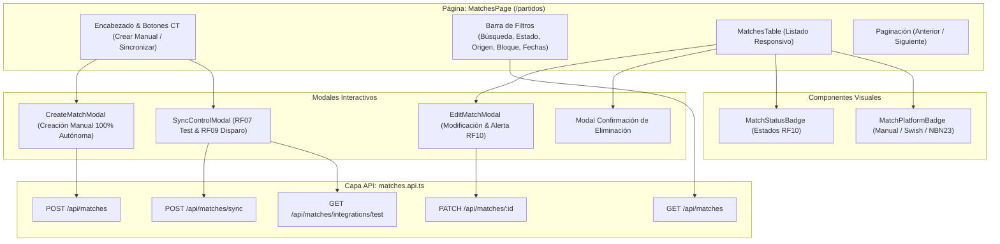

# SGAOB — Documento de Avance de Proyecto: PR10
**Sistema de Gestión de Árbitros y Oficiales de Básquetbol**  
**Proyecto Capstone — Ingeniería en Informática, Duoc UC**  
**Hito:** Módulo 3 (Integración y Sincronización) — Cartelera de Partidos, Creación Manual Autónoma, Modificación con Alertas RF10 y Sincronización Bajo Demanda (Frontend)  
**Fecha de corte:** Septiembre 2026  
**Equipo de desarrollo:** SGAOB Team  

---

## 1. Resumen Ejecutivo

El presente informe documenta formalmente la finalización del Pull Request **PR10** (`feat(web/matches)`), con el cual se completa de manera integral el **Módulo 3: Integración y Sincronización (RF07, RF08, RF09, RF10)** en todo el stack de la aplicación (Frontend React + Backend NestJS + PostgreSQL 18).

En este hito se implementó la interfaz visual que permite a los árbitros, oficiales de mesa y miembros de la Comisión Técnica consultar la cartelera oficial de partidos con filtros dinámicos, distinguiendo claramente el origen de los datos (partidos federados vía Swish/NBN23 vs. partidos locales creados de forma manual). Asimismo, se dotó a la Comisión Técnica de herramientas interactivas para:
1. Crear partidos manualmente de forma 100% autónoma sin dependencias externas.
2. Reprogramar o suspender partidos, informando sobre el disparo automático de alertas por correo a los árbitros ya nominados (RF10).
3. Probar conectividad con plataformas externas (RF07) y ejecutar sincronizaciones bajo demanda (RF09) mediante colas asíncronas BullMQ.

---

## 2. Alcance Real Ejecutado

- **Capa de Servicio API ([`matches.api.ts`](file:///c:/Users/mella/OneDrive/Documentos/Proyectos/CapstoneMain/apps/web/src/api/matches.api.ts)):**
  - Métodos tipados para listado con filtros y paginación (`getMatches`), consulta por ID (`getMatchById`), creación manual (`createMatch`), edición y cambio de estado (`updateMatch`), eliminación (`deleteMatch`), disparo de sincronización (`triggerSync`) y prueba de conectividad (`testIntegration`).
- **Página Principal de Partidos ([`MatchesPage.tsx`](file:///c:/Users/mella/OneDrive/Documentos/Proyectos/CapstoneMain/apps/web/src/pages/MatchesPage.tsx)):**
  - Panel superior con accesos directos para la Comisión Técnica ("Nuevo Partido Manual" y "Sincronizar (RF09)").
  - Barra de búsqueda combinada (torneo, equipo, recinto) con filtros por estado, plataforma de origen, bloque horario (`HORARIO_1`, `HORARIO_2`, `AMBOS`) y rango de fechas (desde/hasta).
  - Paginación dinámica con control de tamaño de página y estados de carga accesibles.
- **Tabla Responsiva de Cartelera ([`MatchesTable.tsx`](file:///c:/Users/mella/OneDrive/Documentos/Proyectos/CapstoneMain/apps/web/src/components/matches/MatchesTable.tsx)):**
  - Visualización tabular con columnas: Fecha/Hora (con badges de bloque horario Anexo A.4), Torneo y Categoría, Encuentro (Local vs Visita), Recinto deportivo, Estado semántico y Origen del partido.
  - Indicador de nominaciones asignadas por partido (`X asignado(s)`).
  - Acciones administrativas contextuales (Modificar y Eliminar) exclusivas para `ADMIN_COMISION_TECNICA`.
- **Modal de Creación Manual Autónoma ([`CreateMatchModal.tsx`](file:///c:/Users/mella/OneDrive/Documentos/Proyectos/CapstoneMain/apps/web/src/components/matches/CreateMatchModal.tsx)):**
  - Formulario estructurado para registro de torneos, categorías, equipos, recintos, fecha y hora.
  - Informa al usuario sobre el cálculo automático del bloque horario según las reglas de negocio (Anexo A.4).
- **Modal de Edición y Actualización de Estado ([`EditMatchModal.tsx`](file:///c:/Users/mella/OneDrive/Documentos/Proyectos/CapstoneMain/apps/web/src/components/matches/EditMatchModal.tsx)):**
  - Permite reprogramar horarios, cambiar recintos o marcar partidos como `SUSPENDED`, `CANCELLED` o `RESCHEDULED`.
  - Incluye advertencia visual contextual informando que al guardar cambios críticos, el sistema enviará correos de alerta automáticos al personal técnico nominado (RF10).
- **Modal de Control de Sincronización ([`SyncControlModal.tsx`](file:///c:/Users/mella/OneDrive/Documentos/Proyectos/CapstoneMain/apps/web/src/components/matches/SyncControlModal.tsx)):**
  - Selector de plataforma (Swish / NBN23) y conmutador de Modo Sandbox / Fixture Simulado ($0 Costo).
  - Diagnóstico de conectividad en tiempo real (RF07).
  - Botón de disparo de sincronización asíncrona (RF09) que retorna el identificador de trabajo BullMQ (`jobId`).
- **Badges Semánticos ([`MatchStatusBadge.tsx`](file:///c:/Users/mella/OneDrive/Documentos/Proyectos/CapstoneMain/apps/web/src/components/matches/MatchStatusBadge.tsx), [`MatchPlatformBadge.tsx`](file:///c:/Users/mella/OneDrive/Documentos/Proyectos/CapstoneMain/apps/web/src/components/matches/MatchPlatformBadge.tsx)):**
  - Identificación visual con íconos para Programado, Reprogramado (alerta pulsante), Suspendido (alerta roja), Cancelado (tachado) y Finalizado (verde).
  - Distinción entre origen Manual (Púrpura), Swish (Azul) y NBN23 (Verde esmeralda).
- **Navegación e Integración:**
  - Nueva ruta `/partidos` protegida por `RoleGuard` en [`App.tsx`](file:///c:/Users/mella/OneDrive/Documentos/Proyectos/CapstoneMain/apps/web/src/App.tsx).
  - Enlaces en barra de navegación de escritorio y menú móvil en [`Navbar.tsx`](file:///c:/Users/mella/OneDrive/Documentos/Proyectos/CapstoneMain/apps/web/src/components/layout/Navbar.tsx).
  - Tarjeta de acceso rápido a la cartelera en [`DashboardPage.tsx`](file:///c:/Users/mella/OneDrive/Documentos/Proyectos/CapstoneMain/apps/web/src/pages/DashboardPage.tsx).

---

## 3. Arquitectura de Componentes Frontend



---

## 4. Trazabilidad con Requerimientos Funcionales (Módulo 3)

| Código RF | Requerimiento Funcional | Estado | Evidencia de Implementación |
|---|---|---|---|
| **RF07** | Configuración/conexión con NBN23 y Swish | **Cumplido** | Diagnóstico interactivo en `SyncControlModal.tsx` conectando con endpoint `/api/matches/integrations/test`. |
| **RF08** | Sincronización automatizada de partidos (fecha, horario, recinto, equipos, torneo) | **Cumplido** | Renderizado en `MatchesTable.tsx` de todos los atributos requeridos con cálculo de bloques horarios. |
| **RF09** | Sincronización manual bajo demanda (botón "actualizar ahora") | **Cumplido** | Botón "Sincronizar (RF09)" en `MatchesPage.tsx`, modal de ejecución con spinner y confirmación de `jobId` BullMQ. |
| **RF10** | Detección de suspensión/reprogramación y alerta al personal | **Cumplido** | Badges dinámicos (`RESCHEDULED`, `SUSPENDED`, `CANCELLED`), advertencia visual en `EditMatchModal.tsx` y reflejo en cartelera. |
| **Autonomía** | Creación y administración manual de partidos sin APIs externas | **Cumplido** | `CreateMatchModal.tsx` permite crear partidos locales con `platform: MANUAL` sin costo alguno. |

---

## 5. Evidencia Verificable de Funcionamiento

### 5.1 Compilación de Frontend y Monorepo
Ejecución de `npm run build` desde la raíz del proyecto:
- `@sgaob/shared`: Compilación TypeScript exitosa.
- `@sgaob/api`: Compilación NestJS exitosa.
- `@sgaob/web`: Compilación Vite + TypeScript exitosa (1658 módulos transformados en 2.58s, 0 errores de tipado).

```text
✓ 1658 modules transformed.
dist/index.html                   0.58 kB │ gzip:   0.38 kB
dist/assets/index-D7EFttTM.css   36.37 kB │ gzip:   6.48 kB
dist/assets/index-AFyw4Txh.js   362.48 kB │ gzip: 100.83 kB
✓ built in 2.58s
```

### 5.2 Pruebas Unitarias y E2E del Sistema
- **Pruebas Unitarias Backend:** 84 pasadas de 84 evaluadas (12 suites, 100% éxito).
- **Pruebas E2E Backend:** 24 pasadas de 24 evaluadas contra PostgreSQL 18 (100% éxito).
