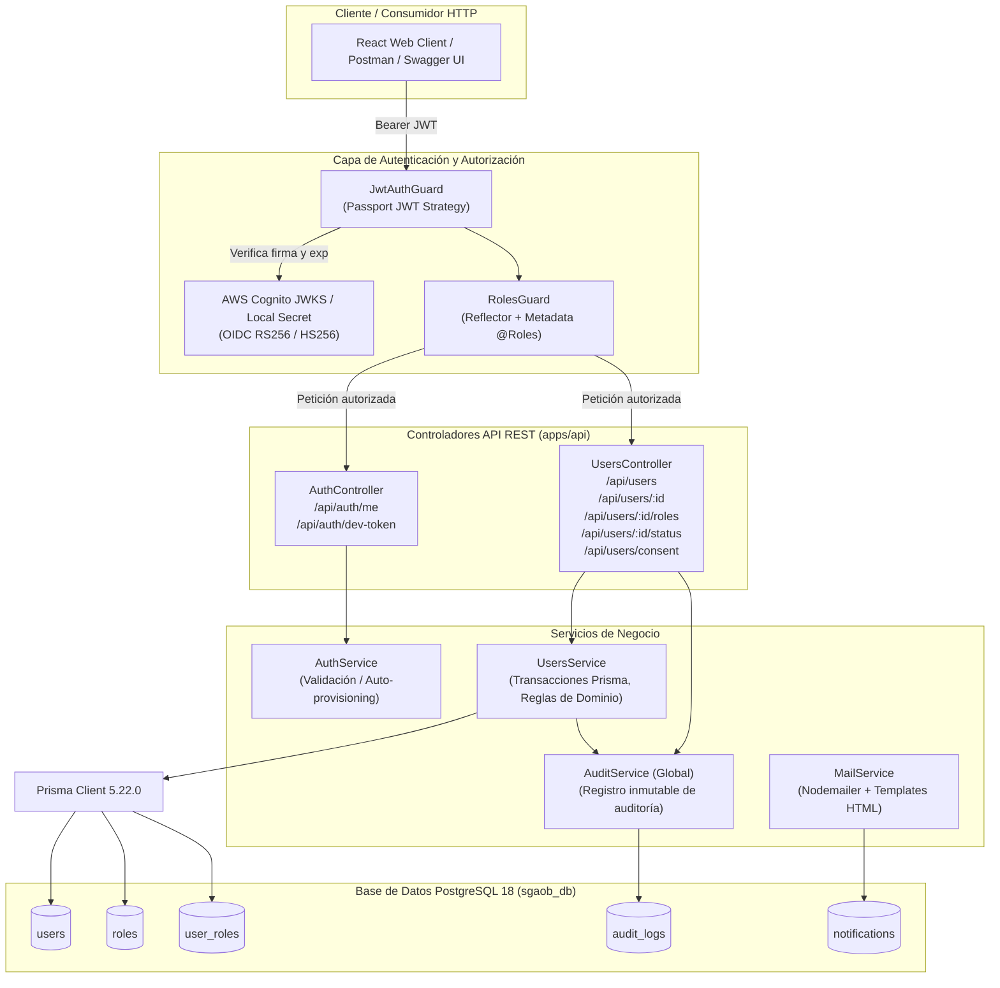

# SGAOB — Documento de Avance de Proyecto: PR3 y PR4
**Sistema de Gestión de Árbitros y Oficiales de Básquetbol**  
**Proyecto Capstone — Ingeniería en Informática, Duoc UC**  
**Hito:** Módulo 1 (Seguridad y Usuarios) — Autenticación Agnóstica, Autorización RBAC, CRUD de Perfiles, Notificaciones y Auditoría  
**Fecha de corte:** Septiembre 2026  
**Equipo de desarrollo:** SGAOB Team  

---

## 1. Resumen Ejecutivo

El presente documento consolida y evidencia formalmente el trabajo realizado durante los Pull Requests **PR3** y **PR4**, correspondientes a la implementación integral de la lógica de negocio y seguridad del **Módulo 1: Seguridad y Usuarios**, según las especificaciones técnicas del documento de requerimientos funcionales (RF01, RF02, RF03 y Anexo A.1).

### Alcance Real Ejecutado
- **Módulo de Notificaciones Transaccionales (`feat(api/mail)` — Commit `e09688b`):** Implementación de [`MailService`](file:///c:/Users/mella/OneDrive/Documentos/Proyectos/CapstoneMain/apps/api/src/common/mail/mail.service.ts) desacoplado mediante `nodemailer` para envío de correos vía Mailpit en entorno local (`localhost:1025`) y Amazon SES / SMTP en producción. Registro sincrónico y persistente de cada evento en la tabla `notifications` de PostgreSQL.
- **PR3 (`feat(api/auth)` — Commit `01a5dd7`):** Implementación de la estrategia de autenticación JWT agnóstica ([`JwtStrategy`](file:///c:/Users/mella/OneDrive/Documentos/Proyectos/CapstoneMain/apps/api/src/modules/auth/jwt.strategy.ts)) con soporte dual: validación de firmas OIDC RS256 contra el JWKS de **AWS Cognito** (`us-east-1`) y fallback de desarrollo local HS256 (`/api/auth/dev-token`). Implementación de guardas de autorización basada en roles (RBAC) con [`JwtAuthGuard`](file:///c:/Users/mella/OneDrive/Documentos/Proyectos/CapstoneMain/apps/api/src/common/guards/jwt-auth.guard.ts), [`RolesGuard`](file:///c:/Users/mella/OneDrive/Documentos/Proyectos/CapstoneMain/apps/api/src/common/guards/roles.guard.ts) y decoradores personalizados (`@Roles()`, `@CurrentUser()`, `@Public()`).
- **PR4 (`feat(api/users)` — Commit `ca7d463`):** Implementación del servicio transversal de auditoría inmutable ([`AuditService`](file:///c:/Users/mella/OneDrive/Documentos/Proyectos/CapstoneMain/apps/api/src/common/audit/audit.service.ts)), endpoints para administración y consulta de perfiles de usuario, registro del consentimiento formal de tratamiento de datos personales (RF01), y el mecanismo estricto de asignación de roles técnicos que garantiza la **independencia operativa entre Árbitro y Oficial de Mesa** (RF02, Anexo A.1).
- **Cobertura y Verificación:** Cobertura de pruebas automatizadas con **46 tests unitarios** y **11 tests End-to-End (E2E)** ejecutados directamente contra PostgreSQL 18.

---

## 2. Arquitectura de Seguridad y Backend Implementada

La capa backend de NestJS (`apps/api`) fue dotada de una arquitectura modular basada en el patrón Controller → Service → Repository (vía Prisma ORM), con control de acceso declarativo en cada capa.



---

## 3. Decisiones de Diseño y Reglas de Negocio Clave

### 3.1. Independencia Estricta de Roles Técnicos (RF02, Anexo A.1)
* **Regla de Negocio:** En el básquetbol formativo y profesional, una persona puede desempeñarse exclusivamente como Árbitro, exclusivamente como Oficial de Mesa, o poseer ambas acreditaciones simultáneamente. No son excluyentes ni jerárquicos entre sí.
* **Implementación:** La relación entre usuarios y roles está modelada como muchos-a-muchos mediante la tabla de unión `user_roles`. El endpoint `PATCH /api/users/:id/roles` recibe una lista de roles (`RoleName[]`) y ejecuta una transacción atómica en Prisma:
  1. Elimina las asociaciones anteriores del usuario.
  2. Valida la existencia de cada rol solicitado en la tabla `roles`.
  3. Crea los registros correspondientes.
  4. Si el usuario se encontraba en estado `PENDING_ROLE` y recibe al menos un rol técnico, transiciona automáticamente a estado `ACTIVE`.
  5. Genera un registro de auditoría con el diff de roles previos vs. nuevos.

### 3.2. Estrategia de Autenticación OIDC Agnóstica (RF01)
* **Problema:** En entornos académicos (AWS Academy Learner Lab) las credenciales de AWS caducan periódicamente y el despliegue de Cognito puede presentar limitaciones de cuota.
* **Solución:** Se implementó una estrategia JWT desacoplada (`JwtStrategy`):
  * **Modo `cognito` / `azure`:** Descarga y valida asíncronamente las claves públicas mediante `jwks-rsa` (RS256).
  * **Modo `local`:** Valida firmas simétricas (HS256) emitidas por el endpoint de utilidad `/api/auth/dev-token`.
  * **Aprovisionamiento Just-in-Time (JIT):** Si un usuario se autentica exitosamente en Cognito pero aún no existe en la base de datos de PostgreSQL, `AuthService.validateOrCreateUser` lo registra automáticamente con estado `PENDING_ROLE`.

### 3.3. Servicio de Auditoría Inmutable (RF01, RF03)
* Cada acción administrativa o mutación de estado queda registrada en la tabla `audit_logs` con la siguiente estructura:
  * `userId`: ID del usuario que realizó la acción (o `null` para acciones del sistema).
  * `action`: Enumeración `AuditAction` (`USER_CREATED`, `USER_UPDATED`, `ROLES_ASSIGNED`, etc.).
  * `entityType` y `entityId`: Entidad afectada (`User`, `Match`, etc.).
  * `details`: JSONB con el detalle de los cambios realizados.
  * `ipAddress`: Dirección IP del cliente remitente.

### 3.4. Consentimiento de Datos Personales (RF01, Cumplimiento Legal)
* Endpoint `POST /api/users/consent` que exige `{ consent: true }` y actualiza atómicamente `dataConsent = true` y `dataConsentDate = NOW()` en la tabla `users`, registrando paralelamente el evento en la auditoría con la IP del solicitante.

---

## 4. Endpoints Implementados y Contratos OpenAPI (Swagger)

Todos los endpoints se encuentran protegidos, tipados con DTOs de `class-validator` y documentados mediante decoradores Swagger en `http://localhost:3000/api/docs`.

| Método | Endpoint | Roles Permitidos | DTO Entrada | Código Exitoso | Descripción |
|---|---|---|---|---|---|
| `GET` | `/api/health` | Público | Ninguno | `200 OK` | Liveness check del servidor y uptime. |
| `POST` | `/api/auth/dev-token` | Público (solo dev) | `DevTokenDto` | `201 Created` | Genera un token JWT de prueba con roles seleccionables para desarrollo y testing. |
| `GET` | `/api/auth/me` | Autenticado | Ninguno | `200 OK` | Retorna el perfil y los roles del usuario que presenta el token Bearer. |
| `POST` | `/api/users` | `ADMIN_COMISION_TECNICA` | `CreateUserDto` | `201 Created` | Pre-registro de un nuevo usuario con roles iniciales opcionales. |
| `GET` | `/api/users` | `ADMIN_COMISION_TECNICA` | `QueryUsersDto` | `200 OK` | Listado paginado con filtros (`page`, `limit`, `role`, `status`, `search`). |
| `GET` | `/api/users/:id` | Propietario / Admin | Parámetro `id` | `200 OK` | Detalle del perfil. Retorna `403` si un usuario regular intenta ver a otro. |
| `PATCH` | `/api/users/:id` | Propietario / Admin | `UpdateUserDto` | `200 OK` | Actualización de datos de contacto (`firstName`, `lastName`, `phone`). |
| `PATCH` | `/api/users/:id/roles` | `ADMIN_COMISION_TECNICA` | `AssignRolesDto` | `200 OK` | Asignación de roles independientes (`ARBITRO`, `OFICIAL_MESA`, `ADMIN_COMISION_TECNICA`). |
| `PATCH` | `/api/users/:id/status` | `ADMIN_COMISION_TECNICA` | `UpdateUserStatusDto` | `200 OK` | Habilitación o suspensión del usuario (`ACTIVE`, `INACTIVE`, `PENDING_ROLE`). |
| `POST` | `/api/users/consent` | Autenticado | `DataConsentDto` | `200 OK` | Registro de consentimiento de tratamiento de datos personales con IP. |

---

## 5. Estructura Real del Código Backend

```
apps/api/src/
├── app.controller.spec.ts
├── app.controller.ts
├── app.module.ts
├── app.service.ts
├── main.ts
├── common/
│   ├── audit/
│   │   ├── audit.module.ts
│   │   └── audit.service.ts
│   ├── decorators/
│   │   ├── current-user.decorator.ts
│   │   ├── public.decorator.ts
│   │   └── roles.decorator.ts
│   ├── guards/
│   │   ├── jwt-auth.guard.ts
│   │   ├── roles.guard.spec.ts
│   │   └── roles.guard.ts
│   ├── mail/
│   │   ├── mail.module.ts
│   │   ├── mail.service.spec.ts
│   │   └── mail.service.ts
│   └── prisma/
│       ├── prisma.module.ts
│       └── prisma.service.ts
└── modules/
    ├── auth/
    │   ├── auth.controller.ts
    │   ├── auth.module.ts
    │   ├── auth.service.spec.ts
    │   ├── auth.service.ts
    │   ├── auth.types.ts
    │   ├── jwt.strategy.spec.ts
    │   └── jwt.strategy.ts
    └── users/
        ├── dto/
        │   ├── assign-roles.dto.ts
        │   ├── create-user.dto.ts
        │   ├── data-consent.dto.ts
        │   ├── index.ts
        │   ├── query-users.dto.ts
        │   ├── update-status.dto.ts
        │   └── update-user.dto.ts
        ├── users.controller.spec.ts
        ├── users.controller.ts
        ├── users.module.ts
        ├── users.service.spec.ts
        └── users.service.ts
```

---

## 6. Trazabilidad a Requerimientos del Sistema (ERS)

| Requerimiento / Caso de Uso | Descripción en ERS | Estado en PR3/PR4 | Detalle de Implementación Real |
|---|---|---|---|
| **RF01** (Autenticación y Registro) | Inicio de sesión único con OIDC/JWT, consentimiento de privacidad. | **100% Backend** | `JwtStrategy` con soporte dual Cognito/Local, decorador `@Public`, endpoint `POST /api/users/consent` con guardado de fecha e IP. |
| **RF02** (Gestión de Roles) | Asignación y control de roles técnicos con independencia entre árbitro y mesa. | **100% Backend** | `PATCH /api/users/:id/roles` permite asignar `[ARBITRO, OFICIAL_MESA]` en la misma transacción. Validado en unit y e2e tests. |
| **RF03** (Administración de Usuarios) | CRUD de perfiles, listado con filtros, cambio de estado (activo/inactivo). | **100% Backend** | `POST /api/users`, `GET /api/users` (filtros combinados), `PATCH /api/users/:id/status`. Paginación y control de acceso RBAC. |
| **RF10 / RF14** (Preparación Notificaciones) | Notificaciones automáticas por cambio de estado o nominación. | **Fundación Completa** | `MailService` y tabla `notifications` implementados con plantillas HTML y tests unitarios. |
| **NFR Seguridad & Auditoría** | Registro inmutable de transacciones críticas y autorización por perfiles. | **100% Backend** | `AuditService` integrado globalmente. Tabla `audit_logs` almacena cada creación, edición o cambio de rol. |

---

## 7. Evidencia de Funcionamiento y Pruebas Automatizadas

### 7.1. Pruebas Unitarias (Jest)
Ejecución del comando:
```bash
npm run test --workspace=@sgaob/api
```

**Resultado de la ejecución:**
```text
PASS src/common/guards/roles.guard.spec.ts
PASS src/app.controller.spec.ts
PASS src/modules/auth/auth.service.spec.ts
PASS src/common/mail/mail.service.spec.ts
PASS src/modules/auth/jwt.strategy.spec.ts
PASS src/modules/users/users.service.spec.ts
PASS src/modules/users/users.controller.spec.ts

Test Suites: 7 passed, 7 total
Tests:       46 passed, 46 total
Snapshots:   0 total
Time:        6.511 s
```

### 7.2. Pruebas de Integración End-to-End (E2E)
Ejecutadas contra la base de datos real PostgreSQL (`sgaob_db`):
```bash
npm run test:e2e --workspace=@sgaob/api
```

**Resultado de la ejecución:**
```text
PASS test/app.e2e-spec.ts
  AppController (e2e)
    √ /api/health (GET) (22 ms)
    Auth Endpoints (e2e)
      √ /api/auth/me (GET) - Debe rechazar petición sin Bearer token (401) (6 ms)
      √ /api/auth/dev-token (POST) - Debe generar token de prueba para desarrollo local (201) (20 ms)
      √ /api/auth/me (GET) - Debe retornar el perfil al enviar Bearer token válido (200) (7 ms)
    Users Endpoints (e2e)
      √ GET /api/users - Debe rechazar acceso a usuarios sin rol de administración (403) (4 ms)
      √ POST /api/users - Debe permitir al Admin registrar un nuevo usuario (201) (12 ms)
      √ POST /api/users - Debe rechazar correo duplicado con 409 Conflict (4 ms)
      √ GET /api/users - Debe listar usuarios con paginación al Admin (200) (36 ms)
      √ GET /api/users/:id - Debe obtener detalle del usuario recién creado (200) (6 ms)
      √ PATCH /api/users/:id/roles - Debe permitir asignar simultáneamente ARBITRO y OFICIAL_MESA (200) (12 ms)
      √ POST /api/users/consent - Debe registrar consentimiento de datos personales del usuario autenticado (200) (7 ms)

Test Suites: 1 passed, 1 total
Tests:       11 passed, 11 total
Snapshots:   0 total
Time:        4.123 s
```

### 7.3. Compilación Monorepo (TypeScript Strict)
```bash
npm run build
```
**Resultado:** Éxito en `@sgaob/shared`, `@sgaob/api` y `@sgaob/web`.

---

## 8. Obstáculos Encontrados y Soluciones Aplicadas

1. **Incompatibilidad de paquete `@nestjs/jwt` v12 con Jest:**
   - *Problema:* La versión 12 de `@nestjs/jwt` se distribuye como ESM puro, produciendo fallas de resolución de módulos bajo la suite Jest en CommonJS.
   - *Solución:* Se ajustó la dependencia a la versión `^10.2.0`, completamente compatible y estable en NestJS 10.
2. **Validación estricta de tipos de parámetros en Prisma ORM:**
   - *Problema:* Los parámetros de paginación (`page` y `limit`) provenientes de la query string ingresaban como `string` (`"10"`), provocando un error de tipo `PrismaClientValidationError` en la propiedad `take`.
   - *Solución:* Se incorporó conversión defensiva explícita `Number(query.page)` y `Number(query.limit)` en `UsersService`, además de configurar `enableImplicitConversion: true` en el `ValidationPipe` global.
3. **Código de estado HTTP en registro de consentimiento:**
   - *Problema:* El estándar de NestJS para rutas `@Post()` asigna por defecto el código `201 Created`, cuando la aceptación de consentimiento es una confirmación de actualización `200 OK`.
   - *Solución:* Se decoró el controlador con `@HttpCode(HttpStatus.OK)`.

---

## 9. Próximos Pasos en el Cronograma

1. **PR5: Setup del Frontend y Capa de Autenticación (`apps/web`):**
   - Configuración de cliente HTTP centralizado (Axios) con interceptor para adjuntar el Bearer Token automáticamente y manejar respuestas 401/403.
   - Implementación del contexto de autenticación (`AuthContext` / `useAuth`).
   - Implementación de selector de perfil de desarrollo (*Dev Auth Switcher*) para alternar en tiempo real entre perfiles de Admin, Árbitro y Oficial de Mesa.
   - Enrutador (`react-router-dom`) con rutas protegidas (`ProtectedRoute`) y guardas de rol (`RoleGuard`).
2. **PR6: Vistas del Módulo de Seguridad y Usuarios en Frontend:**
   - Pantalla de inicio de sesión y gestión de sesión.
   - Modal de aceptación obligatoria de consentimiento de datos (RF01).
   - Vista de administración de usuarios (RF03): tabla interactiva, filtros por rol y estado, búsqueda de texto.
   - Modal de asignación de roles técnicos con validación independiente de casillas para Árbitro y Oficial de Mesa (RF02).
3. **Inicio de Módulo 2: Disponibilidad (RF04, RF05, RF06).**

---

## 10. Vinculación con el Perfil de Egreso Capstone

El avance de PR3 y PR4 refleja la aplicación de las competencias clave del perfil de egreso:
* **Diseño e Implementación de Seguridad en Aplicaciones Web:** Configuración de autenticación OIDC/JWT agnóstica a la nube, autorización granular basada en roles (RBAC) con guardas NestJS y protección de datos sensibles.
* **Modelado y Reglas de Negocio Complejas:** Traducción de requerimientos deportivos reales (independencia estricta entre Árbitro y Oficial de Mesa) en restricciones relacionales y transacciones de base de datos seguras.
* **Auditoría y Trazabilidad de Sistemas:** Implementación de logging inmutable de eventos administrativos para asegurar transparencia en la designación y gestión de personal deportivo.
* **Aseguramiento de Calidad y Testing Automatizado:** Diseño y ejecución de suites de pruebas unitarias y de integración E2E, garantizando robustez ante regresiones.
