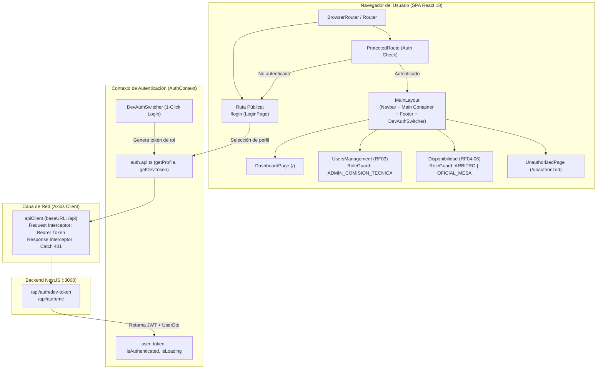

# SGAOB — Documento de Avance de Proyecto: PR5
**Sistema de Gestión de Árbitros y Oficiales de Básquetbol**  
**Proyecto Capstone — Ingeniería en Informática, Duoc UC**  
**Hito:** Módulo 1 (Seguridad y Usuarios) — Frontend Base, Autenticación, Dev Switcher y Enrutamiento Protegido (RBAC)  
**Fecha de corte:** Septiembre 2026  
**Equipo de desarrollo:** SGAOB Team  

---

## 1. Resumen Ejecutivo

El presente informe documenta formalmente los resultados del Pull Request **PR5** (`feat(web/auth)` — Commit `d48f3af`). El objetivo de esta etapa consistió en transformar el cliente web ([`apps/web`](file:///c:/Users/mella/OneDrive/Documentos/Proyectos/CapstoneMain/apps/web)) de un esqueleto estático básico a una aplicación SPA (*Single Page Application*) funcional y reactiva, dotada de infraestructura cliente para consumo de API REST, gestión centralizada del estado de autenticación, control de acceso granular por roles técnicos (RBAC) y un selector rápido de perfiles para evaluación.

### Alcance Real Ejecutado
- **Cliente HTTP Centralizado (`apiClient`):** Configuración de instancia de Axios con `baseURL` dinámica, inyección automática de cabeceras `Authorization: Bearer <token>` mediante interceptores de petición, y gestión global de expiración de sesión (código 401) con redirección controlada a la vista de login.
- **Capa de Autenticación React (`AuthContext` & `useAuth`):** Almacenamiento seguro del token JWT en `localStorage`, hidratación asíncrona del perfil desde `/api/auth/me`, estado reactivo (`user`, `token`, `isAuthenticated`, `isLoading`) y función de verificación de roles `hasRole(...)`.
- **Selector de Perfiles de Evaluación (`DevAuthSwitcher`):** Panel interactivo colapsable que permite alternar en tiempo real entre 5 perfiles preconfigurados (Admin Comisión Técnica, Árbitro, Oficial de Mesa, Doble Rol Independiente y Usuario sin rol), permitiendo evaluar de inmediato las reglas de negocio y restricciones visuales del sistema.
- **Sistema de Enrutamiento y Guardas RBAC (`react-router-dom`):**
  - [`ProtectedRoute`](file:///c:/Users/mella/OneDrive/Documentos/Proyectos/CapstoneMain/apps/web/src/components/auth/ProtectedRoute.tsx): Bloquea el acceso a usuarios no autenticados redirigiéndolos al inicio de sesión y preservando la ruta previa de navegación.
  - [`RoleGuard`](file:///c:/Users/mella/OneDrive/Documentos/Proyectos/CapstoneMain/apps/web/src/components/auth/RoleGuard.tsx): Verifica que el usuario posea los roles técnicos requeridos para acceder a una sección; de lo contrario, redirige a una pantalla amigable de acceso no autorizado (`/unauthorized`).
- **Diseño Visual y Accesibilidad:** Incorporación de **Tailwind CSS 3.4**, componentes con soporte de navegación por teclado accesible (anillos de foco WCAG 2.1 AA `*:focus-visible`), indicadores de carga con soporte de lectores de pantalla (`aria-live="polite"`), barra de navegación responsiva ([`Navbar`](file:///c:/Users/mella/OneDrive/Documentos/Proyectos/CapstoneMain/apps/web/src/components/layout/Navbar.tsx)) y Layout general ([`MainLayout`](file:///c:/Users/mella/OneDrive/Documentos/Proyectos/CapstoneMain/apps/web/src/components/layout/MainLayout.tsx)).

---

## 2. Arquitectura del Frontend y Flujo de Navegación



---

## 3. Decisiones de Diseño y Solución de Desafíos Técnicos

### 3.1. Selector Rápido de Roles para Evaluación Docente
* **Justificación:** En revisiones académicas y defensas de proyecto, autenticarse manualmente mediante formularios complejos o proveedores externos con MFA añade fricción innecesaria. El componente flotante `DevAuthSwitcher` permite al docente o evaluador experimentar la aplicación bajo la perspectiva de cada rol de negocio con un solo clic, verificando en vivo cómo los menús, rutas y acciones cambian dinámicamente según los permisos asignados.

### 3.2. Resolución de Enums Compartidos en Bundler ESM (Vite)
* **Desafío:** `packages/shared` se compila a CommonJS (`dist/index.js`), lo cual impedía que el empaquetador Rollup de Vite analizara estáticamente las exportaciones nombradas (`RoleName`).
* **Solución Aplicada:** Se configuró un alias de resolución en [`apps/web/vite.config.ts`](file:///c:/Users/mella/OneDrive/Documentos/Proyectos/CapstoneMain/apps/web/vite.config.ts) apuntando directamente a `packages/shared/src`:
  ```typescript
  resolve: {
    alias: {
      '@sgaob/shared': path.resolve(__dirname, '../../packages/shared/src'),
    },
  }
  ```
  Esto permite que Vite compile TypeScript al vuelo con `esbuild`, habilitando Hot Module Replacement (HMR) instantáneo entre paquetes del monorepo sin necesidad de reconstruir manualmente la librería compartida tras cada cambio.

### 3.3. Accesibilidad y Estándares WCAG
* Se implementaron anillos de foco visibles (`focus-visible`) para navegación fluida mediante teclado (tecla Tab), contrastes de color acordes a estándares AA, y atributos semánticos `aria-label`, `aria-expanded` y `aria-live`.

---

## 4. Matriz de Rutas y Control de Acceso (RBAC)

| Ruta | Componente Vista | Nivel de Protección | Roles Habilitados | Descripción |
|---|---|---|---|---|
| `/login` | `LoginPage` | Pública | Todos | Acceso mediante selector rápido de perfiles de evaluación o OIDC institucional. |
| `/` | `DashboardPage` | Protegida (`ProtectedRoute`) | Autenticado | Panel principal con estado de perfil, acreditaciones activas y accesos rápidos. |
| `/usuarios` | `UsersManagementPlaceholder` | Protegida (`RoleGuard`) | `ADMIN_COMISION_TECNICA` | Grilla de gestión de usuarios, roles y habilitaciones (RF02, RF03). |
| `/disponibilidad` | `AvailabilityPlaceholder` | Protegida (`RoleGuard`) | `ARBITRO`, `OFICIAL_MESA` | Declaración de bloques horarios y calendario semanal (RF04–RF06). |
| `/nominaciones` | `NominationsPlaceholder` | Protegida (`ProtectedRoute`) | Autenticado | Consulta de partidos y designaciones de árbitros y oficiales de mesa (RF11–RF15). |
| `/unauthorized` | `UnauthorizedPage` | Protegida (`ProtectedRoute`) | Autenticado | Pantalla informativa 403 Forbidden para accesos denegados por falta de rol. |

---

## 5. Evidencia de Funcionamiento y Verificación

### 5.1. Compilación del Frontend (`@sgaob/web`)
```bash
npm run build --workspace=@sgaob/web
```
**Resultado:**
```text
vite v5.4.21 building for production...
transforming...
✓ 1640 modules transformed.
rendering chunks...
computing gzip size...
dist/index.html                   0.58 kB │ gzip:  0.38 kB
dist/assets/index-B2K3Ipul.css   23.56 kB │ gzip:  4.79 kB
dist/assets/index-C8IjgpDw.js   258.17 kB │ gzip: 81.83 kB
✓ built in 2.04s
```

### 5.2. Compilación de Todo el Monorepo
```bash
npm run build
```
**Resultado:** Compilación 100% exitosa en `@sgaob/shared`, `@sgaob/api` y `@sgaob/web`.

### 5.3. Pruebas Unitarias del Backend (Integridad)
```bash
npm run test --workspace=@sgaob/api
```
**Resultado:** **46 tests unitarios pasando** en 7 suites.

### 5.4. Pruebas End-to-End del Backend
```bash
npm run test:e2e --workspace=@sgaob/api
```
**Resultado:** **11 tests E2E pasando** contra PostgreSQL 18.

---

## 6. Trazabilidad a Requerimientos del Sistema (ERS)

| Requerimiento | Descripción | Cobertura en PR5 |
|---|---|---|
| **RF01** (Autenticación y Registro) | Inicio de sesión, preservación de token JWT, cierre de sesión y redirección. | **100% en Frontend base** (`AuthContext`, `apiClient`, `LoginPage`, `Navbar`). |
| **RF02** (Gestión de Roles) | Restricción visual y de navegación según acreditación técnica independiente. | **100% en Enrutamiento** (`RoleGuard`, `DevAuthSwitcher` con rol doble). |
| **RF03** (Administración de Perfiles) | Acceso restringido exclusivo para Comisión Técnica. | **Ruta protegida** `/usuarios` con bloqueo para árbitros/oficiales. |

---

## 7. Próximos Pasos en el Cronograma

1. **PR6: Vistas del Módulo de Seguridad y Usuarios en Frontend:**
   - Implementar la pantalla interactiva de Gestión de Usuarios (`UsersManagementPage`):
     - Grilla con listado de usuarios paginado consumiendo `GET /api/users`.
     - Filtros dinámicos por rol (`ARBITRO`, `OFICIAL_MESA`, `ADMIN`), estado (`ACTIVE`, `INACTIVE`) y buscador por texto.
     - Modal de creación de nuevo perfil (`POST /api/users`).
     - Modal de asignación de roles técnicos independientes (`PATCH /api/users/:id/roles`) con casillas separadas para Árbitro y Oficial de Mesa.
     - Modal de aceptación obligatoria de consentimiento de datos personales (`POST /api/users/consent`).
2. **Inicio del Módulo 2: Disponibilidad (RF04–RF06):**
   - Configuración de bloques horarios (Anexo A.4).
   - Calendario semanal interactivo para declaración de disponibilidad de árbitros y oficiales.
