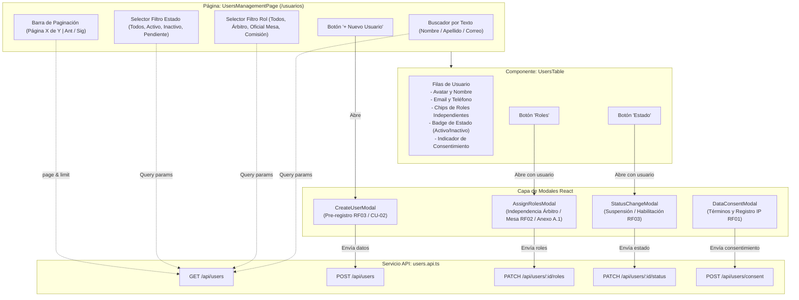

# SGAOB — Documento de Avance de Proyecto: PR6
**Sistema de Gestión de Árbitros y Oficiales de Básquetbol**  
**Proyecto Capstone — Ingeniería en Informática, Duoc UC**  
**Hito:** Módulo 1 (Seguridad y Usuarios) — Vistas de Gestión de Usuarios, Modal de Asignación de Roles Independientes y Diálogo de Consentimiento (Frontend)  
**Fecha de corte:** Septiembre 2026  
**Equipo de desarrollo:** SGAOB Team  

---

## 1. Resumen Ejecutivo

El presente informe documenta formalmente la finalización del Pull Request **PR6** (`feat(web/users)` — Commit `bec3373`), el cual da cierre integral al **Módulo 1: Seguridad y Usuarios** tanto en la capa backend como en la interfaz de usuario frontend ([`apps/web`](file:///c:/Users/mella/OneDrive/Documentos/Proyectos/CapstoneMain/apps/web)).

En esta etapa se implementaron las vistas interactivas completas que permiten a la Comisión Técnica administrar el padrón deportivo, gestionar las acreditaciones técnicas de forma independiente (según Anexo A.1 de la ERS), suspender o activar perfiles, y registrar el consentimiento informado de tratamiento de datos personales (RF01).

### Alcance Real Ejecutado
- **Cliente API de Usuarios ([`users.api.ts`](file:///c:/Users/mella/OneDrive/Documentos/Proyectos/CapstoneMain/apps/web/src/api/users.api.ts)):** Capa de servicio tipada que consume los endpoints REST `/api/users`, integrando paginación, filtros combinables, transacciones de roles, cambios de estado y registro de consentimiento con Axios.
- **Grilla Interactiva de Gestión ([`UsersTable.tsx`](file:///c:/Users/mella/OneDrive/Documentos/Proyectos/CapstoneMain/apps/web/src/components/users/UsersTable.tsx) & [`UsersManagementPage.tsx`](file:///c:/Users/mella/OneDrive/Documentos/Proyectos/CapstoneMain/apps/web/src/pages/UsersManagementPage.tsx)):** Vista protegida por `RoleGuard(ADMIN_COMISION_TECNICA)` con buscador de texto en tiempo real, filtros por rol y estado, paginación remota (`total`, `page`, `limit`, `totalPages`) y chips visuales para cada rol asignado.
- **Modal de Asignación de Roles Técnicos ([`AssignRolesModal.tsx`](file:///c:/Users/mella/OneDrive/Documentos/Proyectos/CapstoneMain/apps/web/src/components/users/AssignRolesModal.tsx)):** Formulario modal que plasma fielmente la regla de negocio de **independencia estricta entre Árbitro y Oficial de Mesa**, permitiendo marcar casillas independientes para ambos roles o para Comisión Técnica sin exclusiones cruzadas.
- **Modal de Pre-registro de Usuarios ([`CreateUserModal.tsx`](file:///c:/Users/mella/OneDrive/Documentos/Proyectos/CapstoneMain/apps/web/src/components/users/CreateUserModal.tsx)):** Permite registrar nuevos integrantes del padrón arbitral con asignación inicial opcional de acreditaciones.
- **Modal de Gestión de Estado ([`StatusChangeModal.tsx`](file:///c:/Users/mella/OneDrive/Documentos/Proyectos/CapstoneMain/apps/web/src/components/users/StatusChangeModal.tsx)):** Control de transiciones de ciclo de vida (`ACTIVE`, `INACTIVE`, `PENDING_ROLE`) para suspender o reincorporar árbitros y oficiales.
- **Diálogo y Banner de Consentimiento de Datos ([`DataConsentModal.tsx`](file:///c:/Users/mella/OneDrive/Documentos/Proyectos/CapstoneMain/apps/web/src/components/users/DataConsentModal.tsx)):** Modal accesible con los términos y finalidades del tratamiento de datos en SGAOB, respaldado por un banner recordatorio en el [`MainLayout`](file:///c:/Users/mella/OneDrive/Documentos/Proyectos/CapstoneMain/apps/web/src/components/layout/MainLayout.tsx) cuando el usuario activo no ha registrado su consentimiento.

---

## 2. Arquitectura de Componentes de la Vista de Usuarios



---

## 3. Decisiones de Diseño y Reglas de Negocio en Frontend

### 3.1. Materialización del Anexo A.1 (Independencia de Acreditaciones)
* **Regla de Negocio:** En el básquetbol, los roles arbitrales y de mesa de control no son jerárquicos ni excluyentes. Un oficial puede actuar como cronometrador el sábado en la mañana y como árbitro de campo el domingo en la tarde.
* **Solución en la Interfaz:** En [`AssignRolesModal.tsx`](file:///c:/Users/mella/OneDrive/Documentos/Proyectos/CapstoneMain/apps/web/src/components/users/AssignRolesModal.tsx) se descartan los controles de selección excluyente (`<select>` o `radio buttons`) en favor de **checkboxes independientes**:
  - `ARBITRO` (Árbitro de Campo)
  - `OFICIAL_MESA` (Oficial de Mesa Técnica)
  - `ADMIN_COMISION_TECNICA` (Comisión Técnica)
* Se incluye una tarjeta informativa destacada con el texto de la regla de negocio para evitar confusiones de los operadores.

### 3.2. Sincronización Inmediata con Refresco Reactivo
* Cuando un modal concluye su operación exitosamente (creación, cambio de rol o actualización de estado), se dispara un callback `onSuccess` que invoca inmediatamente a `fetchUsers()`, actualizando la tabla sin requerir recarga completa del navegador.

### 3.3. Cumplimiento de Consentimiento Informado (RF01)
* El componente [`MainLayout`](file:///c:/Users/mella/OneDrive/Documentos/Proyectos/CapstoneMain/apps/web/src/components/layout/MainLayout.tsx) evalúa constantemente la bandera `user.dataConsent`. Si es `false`, despliega un banner superior de advertencia en color ámbar con un botón de acción rápida que abre el [`DataConsentModal`](file:///c:/Users/mella/OneDrive/Documentos/Proyectos/CapstoneMain/apps/web/src/components/users/DataConsentModal.tsx).
* El modal detalla las 5 finalidades legítimas del tratamiento de datos en SGAOB y actualiza el estado global de la sesión tras la firma digital.

---

## 4. Trazabilidad a Requerimientos del Sistema (ERS)

| Requerimiento Funcional | Descripción ERS | Cobertura en PR6 |
|---|---|---|
| **RF01** (Autenticación y Consentimiento) | Registro de aceptación formal de tratamiento de datos personales. | **100% Completado** (`DataConsentModal` + Banner en `MainLayout` + llamada a `POST /api/users/consent`). |
| **RF02** (Gestión de Roles y Habilitaciones) | Acreditación técnica independiente entre Árbitro y Oficial de Mesa (Anexo A.1). | **100% Completado** (`AssignRolesModal` con casillas independientes y chips distintivos en tabla). |
| **RF03** (Administración de Perfiles) | Pre-registro por Comisión Técnica, listado paginado, filtros y suspensión/activación. | **100% Completado** (`UsersManagementPage`, `CreateUserModal`, `StatusChangeModal`, `UsersTable`). |

---

## 5. Evidencia de Funcionamiento y Pruebas

### 5.1. Compilación del Frontend (`apps/web`)
```bash
npm run build --workspace=@sgaob/web
```
**Resultado:**
```text
vite v5.4.21 building for production...
transforming...
✓ 1646 modules transformed.
rendering chunks...
computing gzip size...
dist/index.html                   0.58 kB │ gzip:  0.38 kB
dist/assets/index-DEyc6STE.css   30.26 kB │ gzip:  5.61 kB
dist/assets/index-nAO--BIN.js   294.90 kB │ gzip: 88.28 kB
✓ built in 2.12s
```

### 5.2. Compilación del Monorepo Completo
```bash
npm run build
```
**Resultado:** Éxito absoluto en `@sgaob/shared`, `@sgaob/api` y `@sgaob/web`.

### 5.3. Pruebas Unitarias Backend
```bash
npm run test --workspace=@sgaob/api
```
**Resultado:** **46 pruebas unitarias exitosas** (7 suites).

### 5.4. Pruebas de Integración End-to-End (E2E)
```bash
npm run test:e2e --workspace=@sgaob/api
```
**Resultado:** **11 pruebas E2E exitosas** contra la base de datos real PostgreSQL 18.

---

## 6. Estado del Módulo 1 y Próximo Hito en el Cronograma

Con la finalización de **PR6**, el **Módulo 1: Seguridad y Usuarios (RF01, RF02, RF03)** queda **100% completado, integrado y probado de extremo a extremo** (Frontend + Backend + Base de Datos + Auditoría).

### Siguiente Módulo según Cronograma: Módulo 2 — Disponibilidad (RF04, RF05, RF06)
- **PR7 (Backend Disponibilidad):**
  - Modelo de datos y endpoints para la parametrización de bloques horarios (Anexo A.4: Horario 1 y Horario 2 en días laborales y fines de semana).
  - Endpoints para declaración masiva semanal de disponibilidad (`HORARIO_1`, `HORARIO_2`, `FULL`, `NO`).
  - Validación de regla de negocio de cierre de plazo de declaración semanal (miércoles 23:59).
  - Pruebas unitarias de cruce y disponibilidad.
- **PR8 (Frontend Disponibilidad):**
  - Calendario semanal interactivo para selección rápida de bloques horarios por parte de árbitros y oficiales de mesa.
  - Panel administrativo de consulta y consolidado de disponibilidad para la Comisión Técnica.

---

## 7. Vinculación con el Perfil de Egreso Capstone

El cierre del Módulo 1 consolida las siguientes competencias formativas:
1. **Desarrollo Full-Stack Orientado a la Experiencia de Usuario (UX/UI):** Implementación de una interfaz SPA fluida, responsiva y accesible que simplifica la interacción de usuarios deportivos y administrativos.
2. **Aplicación Estricta de Restricciones del Dominio:** Aseguramiento de la independencia de roles técnicos en toda la cadena de software (Base de datos relacional → Backend NestJS → Frontend React).
3. **Gobierno y Privacidad de Datos:** Integración visible de mecanismos de consentimiento informado y auditoría de acciones administrativas.
4. **Ciclo de Entrega de Software y Documentación Continua:** Cumplimiento riguroso de convenciones de commits, revisiones de código y documentación incremental de hitos.
