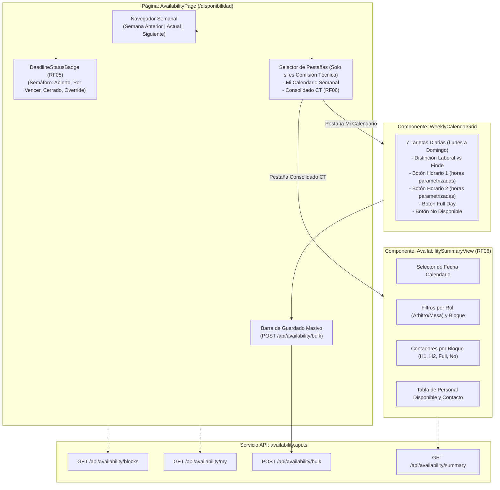

# SGAOB — Documento de Avance de Proyecto: PR8
**Sistema de Gestión de Árbitros y Oficiales de Básquetbol**  
**Proyecto Capstone — Ingeniería en Informática, Duoc UC**  
**Hito:** Módulo 2 (Disponibilidad) — Calendario Semanal Interactivo, Semáforo de Plazo (Miércoles 23:59) y Consolidado de Personal (Frontend)  
**Fecha de corte:** Septiembre 2026  
**Equipo de desarrollo:** SGAOB Team  

---

## 1. Resumen Ejecutivo

El presente informe documenta formalmente la finalización del Pull Request **PR8** (`feat(web/availability)` — Commit `ead9605`), con el cual se da cierre integral al **Módulo 2: Disponibilidad (RF04, RF05, RF06)** en toda la arquitectura de la aplicación (Frontend React + Backend NestJS + PostgreSQL 18).

En esta etapa se implementó la interfaz visual interactiva que permite a los árbitros y oficiales de mesa declarar sus bloques horarios para la semana, informando en tiempo real sobre el estado del plazo límite de cierre de inscripciones fijado los miércoles a las 23:59 (RF05), y ofreciendo a la Comisión Técnica una vista consolidada para la preparación de las designaciones arbitrales (RF06).

### Alcance Real Ejecutado
- **Capa de Servicio Cliente ([`availability.api.ts`](file:///c:/Users/mella/OneDrive/Documentos/Proyectos/CapstoneMain/apps/web/src/api/availability.api.ts)):** Funciones cliente tipadas para consultar bloques vigentes (`getTimeBlocks`), consultar disponibilidad personal (`getMyAvailability`), enviar declaraciones masivas (`declareBulk`) y obtener el reporte agregado de personal (`getAvailabilitySummary`).
- **Calendario Semanal Interactivo ([`WeeklyCalendarGrid.tsx`](file:///c:/Users/mella/OneDrive/Documentos/Proyectos/CapstoneMain/apps/web/src/components/availability/WeeklyCalendarGrid.tsx)):** Cuadrícula responsiva de 7 días (Lunes a Domingo) que distingue visualmente días laborales de fines de semana y muestra los límites horarios parametrizados en el sistema (ej. Horario 1 y Horario 2 según Anexo A.4).
- **Semáforo y Temporizador de Plazo de Cierre ([`DeadlineStatusBadge.tsx`](file:///c:/Users/mella/OneDrive/Documentos/Proyectos/CapstoneMain/apps/web/src/components/availability/DeadlineStatusBadge.tsx)):** Componente visual dinámico que evalúa la cercanía del plazo límite (Miércoles 23:59:59):
  - *Verde (Abierto):* Permite la declaración normal con indicación de fecha límite.
  - *Ámbar (Próximo a cerrar):* Alerta de urgencia dentro de las últimas 24 horas.
  - *Rojo (Vencido):* Bloquea la edición para usuarios regulares pasando a modo solo lectura (RF05).
  - *Púrpura (Override Comisión Técnica):* Informa a los administradores que el modo de excepción está activo para registrar justificaciones.
- **Vista de Consolidado para la Comisión Técnica ([`AvailabilitySummaryView.tsx`](file:///c:/Users/mella/OneDrive/Documentos/Proyectos/CapstoneMain/apps/web/src/components/availability/AvailabilitySummaryView.tsx)):** Pestaña administrativa exclusiva para `ADMIN_COMISION_TECNICA` con selector de fecha, filtros combinables por rol y bloque, tarjetas de conteo y nómina de árbitros disponibles con datos de contacto.
- **Página Principal de Disponibilidad ([`AvailabilityPage.tsx`](file:///c:/Users/mella/OneDrive/Documentos/Proyectos/CapstoneMain/apps/web/src/pages/AvailabilityPage.tsx)):** Control de navegación semanal (semana anterior, actual, próxima), guardado masivo con feedback visual accesible y conmutación entre calendario personal y consolidado administrativo.

---

## 2. Arquitectura de Componentes del Módulo de Disponibilidad



---

## 3. Decisiones de Diseño y Reglas de Negocio en la Interfaz

### 3.1. Cumplimiento de la Restricción Temporal de Cierre (RF05)
* **Regla de Negocio:** La designación de árbitros para los partidos requiere que la disponibilidad semanal esté consolidada el miércoles por la noche.
* **Solución en Frontend:** El componente calcula la marca temporal del miércoles de la semana a las 23:59:59. Si la fecha actual supera dicho plazo:
  - Para usuarios regulares (`ARBITRO`, `OFICIAL_MESA`), todos los botones de selección del calendario se inhabilitan (`disabled={isReadOnly}`), el botón de guardado se desactiva y el semáforo alerta que el plazo expiró.
  - Para usuarios administradores (`ADMIN_COMISION_TECNICA`), los controles permanecen activos y se informa que cualquier cambio se registrará como excepción administrativa en el historial de auditoría.

### 3.2. Adaptabilidad a la Parametrización Horaria (Anexo A.4)
* En lugar de mostrar horarios fijos en el código (*hardcoded*), la cuadrícula semanal consulta dinámicamente `/api/availability/blocks` e inyecta las horas de inicio y fin reales configuradas para días laborales y fines de semana en cada botón de Horario 1 y Horario 2.

### 3.3. Experiencia de Usuario sin Fricción
* Un árbitro puede seleccionar con 7 clics sus opciones de la semana (Lunes a Domingo) y confirmarlas con un solo clic en "Guardar Disponibilidad Semanal", enviando un único payload atómico al backend.

---

## 4. Trazabilidad a Requerimientos del Sistema (ERS)

| Requerimiento Funcional | Descripción ERS | Cobertura en PR8 |
|---|---|---|
| **RF04** (Declaración de Disponibilidad) | Selección de bloques `HORARIO_1`, `HORARIO_2`, `FULL`, `NO` por día. | **100% en Frontend** (`WeeklyCalendarGrid`, `AvailabilityPage`). |
| **RF05** (Plazo de Cierre Semanal) | Indicador de plazo de miércoles 23:59, bloqueo automático y override CT. | **100% en Frontend** (`DeadlineStatusBadge`, bloqueo de botones). |
| **RF06** (Consulta y Consolidado) | Visualización de disponibilidad personal y reporte consolidado para programación. | **100% en Frontend** (`AvailabilitySummaryView`, tarjetas de conteo). |
| **Anexo A.4** (Configuración Paramétrica) | Reflejo en la UI de los rangos de horas configurados para cada día y bloque. | **100% en Frontend** (Consumo reactivo de `TimeBlockConfigDto`). |

---

## 5. Evidencia Verificable de Funcionamiento

### 5.1. Compilación del Frontend (`apps/web`)
```bash
npm run build --workspace=@sgaob/web
```
**Resultado:**
```text
vite v5.4.21 building for production...
transforming...
✓ 1650 modules transformed.
rendering chunks...
computing gzip size...
dist/index.html                   0.58 kB │ gzip:  0.38 kB
dist/assets/index-BBM3B6Sw.css   32.12 kB │ gzip:  5.87 kB
dist/assets/index-ChU0MiYk.js   317.60 kB │ gzip: 92.72 kB
✓ built in 2.25s
```

### 5.2. Compilación de Todo el Monorepo
```bash
npm run build
```
**Resultado:** Compilación 100% exitosa en `@sgaob/shared`, `@sgaob/api` y `@sgaob/web`.

### 5.3. Pruebas Unitarias Backend
```bash
npm run test --workspace=@sgaob/api
```
**Resultado:** **64 pruebas unitarias exitosas** (9 suites).

### 5.4. Pruebas de Integración End-to-End (E2E)
```bash
npm run test:e2e --workspace=@sgaob/api
```
**Resultado:** **17 pruebas E2E exitosas** contra la base de datos real PostgreSQL 18.

---

## 6. Cierre del Módulo 2 y Próximo Hito en el Cronograma

Con la finalización de **PR8**, el **Módulo 2: Disponibilidad (RF04, RF05, RF06)** queda **completado al 100% e integrado de extremo a extremo** (Base de Datos + Backend + Frontend + Pruebas).

### Siguiente Módulo según Cronograma: Módulo 3 — Integración y Sincronización con NBN23 / Swish (RF07, RF08, RF09, RF10)
- **PR9 (Backend Integración / Colas BullMQ):**
  - Implementación del patrón de diseño `MatchSyncProvider` (interfaz agnóstica para proveedores de partidos).
  - Implementación de adaptadores concretos: `Nbn23SyncProvider` y `SwishSyncProvider`.
  - Configuración de colas asíncronas con **BullMQ + Redis** para la sincronización periódica y bajo demanda.
  - Sincronización de partidos a la tabla `matches` con la restricción `@@unique([platform, externalId])` y clasificación automática en bloques horarios (`MatchTimeBlock`: `HORARIO_1`, `HORARIO_2`, `AMBOS`).
  - Detección de cambios de estado del partido (`SCHEDULED`, `IN_PROGRESS`, `FINISHED`, `SUSPENDED`, `CANCELLED`) y disparo de notificaciones automáticas vía `MailService` (RF10).
- **PR10 (Frontend Sincronización de Partidos):**
  - Vista administrativa de partidos sincronizados con botón de sincronización manual bajo demanda y visor de logs de sincronización.

---

## 7. Vinculación con el Perfil de Egreso Capstone

El cierre del Módulo 2 demuestra la aplicación práctica de competencias avanzadas:
1. **Modelado y Visualización de Procesos Temporales Complejos:** Transformación de una regla de negocio de plazos semanales en una interfaz interactiva intuitiva y accesible.
2. **Desarrollo Frontend Basado en Componentes Desacoplados:** Creación de componentes reutilizables (`WeeklyCalendarGrid`, `DeadlineStatusBadge`, `AvailabilitySummaryView`) con separación de responsabilidades y tipado estricto.
3. **Consistencia de Datos de Extremo a Extremo:** Integración coherente de parámetros de base de datos (`TimeBlockConfig`) hasta la vista de usuario sin discrepancias de formato ni desfases horarios.
