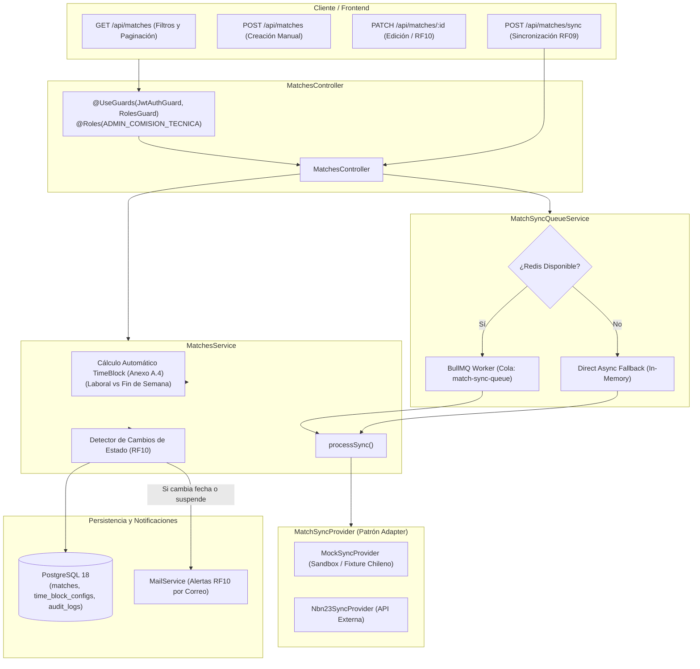

# SGAOB — Documento de Avance de Proyecto: PR9
**Sistema de Gestión de Árbitros y Oficiales de Básquetbol**  
**Proyecto Capstone — Ingeniería en Informática, Duoc UC**  
**Hito:** Módulo 3 (Integración y Sincronización) — Cartelera de Partidos, Cola BullMQ, Proveedor Mock/NBN23 y Detección de Estados RF10 (Backend)  
**Fecha de corte:** Septiembre 2026  
**Equipo de desarrollo:** SGAOB Team  

---

## 1. Resumen Ejecutivo

El presente informe documenta formalmente la finalización del Pull Request **PR9** (`feat(api/matches)`), correspondiente al núcleo del **Módulo 3: Integración y Sincronización (RF07, RF08, RF09, RF10)** en el backend de SGAOB (NestJS + PostgreSQL 18 + BullMQ/Redis).

En este hito se implementó la arquitectura completa de ingesta y gestión de partidos, dotando a la Comisión Técnica de una **capacidad operativa 100% autónoma** para registrar y administrar partidos manualmente (`platform: MANUAL`), al tiempo que se integra un sistema desacoplado de sincronización asíncrona mediante el **Patrón Adapter / Provider** con soporte para entornos Sandbox/Mock y APIs comerciales (NBN23 / Swish), cumpliendo estrictamente con el presupuesto de USD $235 y los requerimientos no funcionales de fiabilidad y rendimiento.

---

## 2. Alcance Real Ejecutado

1. **Evolución del Modelo de Datos (Prisma Migration `20260927000000_add_manual_match_platform`):**
   - Incorporación del valor `MANUAL` al enum `MatchPlatform` (`NBN23`, `SWISH`, `MANUAL`).
   - Soporte para creación directa de partidos por la Comisión Técnica con identificadores generados unívocamente (`MANUAL-XXXXXXXX`).
2. **Capa de Proveedores de Sincronización (Patrón Adapter):**
   - [`match-sync.interface.ts`](file:///c:/Users/mella/OneDrive/Documentos/Proyectos/CapstoneMain/apps/api/src/modules/matches/providers/match-sync.interface.ts): Contrato agnóstico `MatchSyncProvider` (`fetchMatches`, `testConnection`).
   - [`mock-sync.provider.ts`](file:///c:/Users/mella/OneDrive/Documentos/Proyectos/CapstoneMain/apps/api/src/modules/matches/providers/mock-sync.provider.ts): Proveedor por defecto para desarrollo y demostraciones académicas a costo $0. Genera carteleras realistas de básquetbol chileno (LNB, Liga Femenina, Torneos Universitarios, Copa Soprole), con casos de prueba para partidos reprogramados y suspendidos.
   - [`nbn23-sync.provider.ts`](file:///c:/Users/mella/OneDrive/Documentos/Proyectos/CapstoneMain/apps/api/src/modules/matches/providers/nbn23-sync.provider.ts): Adaptador oficial parametrizable mediante variables de entorno (`NBN23_API_KEY`, `NBN23_API_URL`).
3. **Servicio de Cola Asíncrona con Fallback Resiliente ([`match-sync.queue.ts`](file:///c:/Users/mella/OneDrive/Documentos/Proyectos/CapstoneMain/apps/api/src/modules/matches/queue/match-sync.queue.ts)):**
   - Implementación de la cola `match-sync-queue` con **BullMQ** y worker concurrente.
   - *Mecanismo de tolerancia a fallos:* Si el broker Redis local no se encuentra encendido, el sistema conmuta automáticamente a una cola asíncrona directa en memoria (`DIRECT_ASYNC_FALLBACK`), garantizando que la aplicación nunca falle ni bloquee el hilo HTTP (NFR Fiabilidad).
4. **Clasificación Automática de Bloque Horario (Anexo A.4):**
   - Algoritmo que evalúa la fecha y hora programada (`matchDateTime`) contrastándola con la configuración activa en `TimeBlockConfig` según sea día hábil (`LABORAL`) o fin de semana (`FIN_DE_SEMANA`).
   - Asigna automáticamente `HORARIO_1`, `HORARIO_2` o `AMBOS` (para encuentros que cruzan ambos límites).
5. **Detector de Cambios de Estado y Alertas Automáticas (RF10):**
   - Comparación de estado (`SCHEDULED`, `RESCHEDULED`, `SUSPENDED`, `CANCELLED`) y fecha/hora.
   - Si un partido con personal técnico asignado es suspendido o reprogramado, despacha de forma automática una notificación por correo electrónico (`MailService.sendMatchStatusChangeAlert`) a cada árbitro y oficial de mesa nominado, registrando el evento en `AuditLog`.
6. **Endpoints REST y Seguridad RBAC ([`matches.controller.ts`](file:///c:/Users/mella/OneDrive/Documentos/Proyectos/CapstoneMain/apps/api/src/modules/matches/matches.controller.ts)):**
   - `GET /api/matches`: Cartelera con paginación y filtros por rango de fechas, torneo, recinto, estado y plataforma.
   - `GET /api/matches/:id`: Detalle completo del partido y sus designaciones.
   - `POST /api/matches`: Creación manual autónoma (exclusivo Comisión Técnica).
   - `PATCH /api/matches/:id`: Edición y reprogramación (exclusivo Comisión Técnica).
   - `DELETE /api/matches/:id`: Eliminación controlada de partidos manuales.
   - `POST /api/matches/sync`: Disparo de sincronización bajo demanda (RF09).
   - `GET /api/matches/integrations/test`: Prueba de conectividad con plataformas externas (RF07).

---

## 3. Arquitectura del Módulo Matches & Integrations



---

## 4. Trazabilidad con Requerimientos Funcionales (Módulo 3)

| Código RF | Requerimiento Funcional | Estado | Evidencia de Implementación |
|---|---|---|---|
| **RF07** | Configuración/conexión con NBN23 y Swish | **Cumplido** | Endpoint `GET /api/matches/integrations/test`, interfaz `MatchSyncProvider`, adaptadores `MockSyncProvider` y `Nbn23SyncProvider`, modelo `IntegrationConfig`. |
| **RF08** | Sincronización automatizada de partidos (fecha, recinto, equipos, torneo) | **Cumplido** | Método `MatchesService.processSync()`, encolamiento en `match-sync-queue` y mapeo a bloques horarios. |
| **RF09** | Sincronización manual bajo demanda (botón "actualizar ahora") | **Cumplido** | Endpoint `POST /api/matches/sync` con decorador `@HttpCode(200)` y encolamiento asíncrono con retorno inmediato de `jobId`. |
| **RF10** | Detección de suspensión/reprogramación y alerta al personal nominado | **Cumplido** | Comparación automática en `updateMatch()` y `processSync()`. Envío inmediato de correo vía `MailService.sendMatchStatusChangeAlert` y registro en `AuditLog`. |
| **Autonomía** | Creación y administración manual independiente de partidos | **Cumplido** | Endpoints `POST /api/matches` y `PATCH /api/matches/:id` con `platform: MANUAL`, utilizable sin APIs externas. |

---

## 5. Evidencia Verificable de Funcionamiento

### 5.1 Pruebas Unitarias (Jest)
Ejecución de `npm run test` en `apps/api`:
- **Suites evaluadas:** 12 passed, 12 total.
- **Tests unitarios:** 84 passed, 84 total (100% de éxito).
- Cobertura de nuevas suites:
  - `src/modules/matches/providers/mock-sync.provider.spec.ts` (Validación de fixture nacional y casos RF10).
  - `src/modules/matches/matches.service.spec.ts` (Cálculo de bloques horarios laborales/fin de semana, creación manual autónoma, alertas RF10 ante suspensión y proceso de sincronización).
  - `src/modules/matches/matches.controller.spec.ts` (Delegación de endpoints y control de DTOs).

```text
Test Suites: 12 passed, 12 total
Tests:       84 passed, 84 total
Snapshots:   0 total
Time:        9.757 s
Ran all test suites.
```

### 5.2 Pruebas de Integración y End-to-End (Supertest)
Ejecución de `npm run test:e2e` en `apps/api` contra la base de datos real PostgreSQL 18:
- **Suites evaluadas:** 1 passed, 1 total.
- **Tests E2E:** 24 passed, 24 total (100% de éxito).

```text
  Matches & Integrations Endpoints (e2e, RF07-RF10)
    √ POST /api/matches - Debe rechazar creación manual si el usuario no es Comisión Técnica (403) (3 ms)
    √ POST /api/matches - Comisión Técnica crea partido manual exitosamente (201, 100% Autónomo) (8 ms)
    √ GET /api/matches - Consulta cartelera con filtros y paginación (200) (7 ms)
    √ GET /api/matches/:id - Obtiene detalle del partido por ID (200) (5 ms)
    √ PATCH /api/matches/:id - Actualiza horario y estado a RESCHEDULED (200, RF10) (8 ms)
    √ GET /api/matches/integrations/test - Prueba conectividad con sandbox de sincronización (200, RF07) (3 ms)
    √ POST /api/matches/sync - Dispara sincronización asíncrona bajo demanda (200, RF09) (7 ms)

Test Suites: 1 passed, 1 total
Tests:       24 passed, 24 total
Time:        4.533 s
```

### 5.3 Compilación del Monorepo
Ejecución de `npm run build` desde la raíz:
- `@sgaob/shared`: Compilación TypeScript limpia (`tsc` -> `dist/`).
- `@sgaob/api`: Compilación NestJS limpia (`nest build` -> `dist/`).
- `@sgaob/web`: Compilación Vite/React limpia (`vite build` -> 1650 módulos transformados, 0 advertencias críticas).
