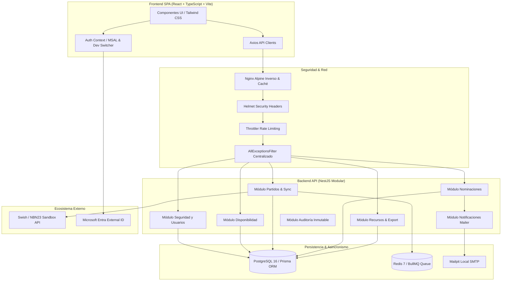

# Informe Final de Cierre de Proyecto Capstone — SGAOB

**Sistema de Gestión de Árbitros y Oficiales de Básquetbol (SGAOB)**  
**Proyecto de Título — Escuela de Informática y Telecomunicaciones, Duoc UC**  
**Fecha de Cierre:** 27 de Septiembre de 2026  
**Versión:** 1.0.0 (Entrega Final)  
**Equipo de Proyecto:** Martín Correa, Ignacio Mella, Benjamín Soto  
**Profesor Guía:** Comisión Evaluadora Capstone  

---

## 1. Resumen Ejecutivo

El **Sistema de Gestión de Árbitros y Oficiales de Básquetbol (SGAOB)** es una plataforma web integral diseñada para erradicar las ineficiencias críticas en la administración del arbitraje de básquetbol en Chile. Tradicionalmente, la coordinación de ternas arbitrales y mesas de control en ligas locales, universitarias y escolares se realizaba mediante planillas manuales de cálculo y mensajería informal (WhatsApp), provocando incompatibilidades horarias, designaciones no notificadas a tiempo, brechas en la privacidad de datos personales y demoras en el reporte administrativo.

SGAOB automatiza y centraliza el ciclo operativo completo del personal técnico en 5 módulos integrados:
1. **Seguridad y Usuarios:** Autenticación agnóstica moderna (Microsoft Entra External ID / AWS Cognito / JWT Local), control estricto de acceso basado en roles (RBAC) y cumplimiento de privacidad con registro explícito de consentimiento (RF01–RF03).
2. **Disponibilidad:** Declaración semanal masiva de disponibilidad horaria por bloques parametrizados según día hábil o fin de semana, validando la regla de cierre de los miércoles a las 23:59 y consolidando la información para la Comisión Técnica (RF04–RF06, Anexo A.4).
3. **Integración y Sincronización:** Cartelera unificada de partidos con sincronización asíncrona mediante colas BullMQ y Redis contra plataformas líderes (Swish / NBN23) y proveedores Sandbox de costo cero, con detección automática de reprogramaciones y cancelaciones (RF07–RF10).
4. **Nominaciones y Asignaciones:** Algoritmo de cruce inteligente que filtra candidatos según rol técnico obligatorio (Árbitro vs. Oficial de Mesa, Anexo A.1) y disponibilidad declarada, notificando vía correo electrónico y permitiendo confirmación o rechazo justificado con trazabilidad inmutable (RF11–RF16, Anexo A.2).
5. **Información y Recursos:** Repositorio oficial de reglamentos FIBA, bóveda segura de credenciales API con forzado incondicional de visibilidad `ADMIN` (Anexo A.5), tablón de anuncios y exportación de la grilla de asignaciones en formato CSV con BOM UTF-8 para Microsoft Excel (RF17–RF20).

---

## 2. Matriz de Cumplimiento de Requerimientos Funcionales (100% Implementado)

| Requerimiento | Descripción | Módulo | Implementación | Estado |
|---|---|---|---|---|
| **RF01** | Autenticación y consentimiento explícito | M1: Seguridad | `POST /api/users/consent`, `DataConsentModal.tsx` | **Aprobado** |
| **RF02** | Gestión de roles independientes (Árbitro vs Mesa) | M1: Seguridad | `PATCH /api/users/:id/roles`, `AssignRolesModal.tsx` | **Aprobado** |
| **RF03** | Perfil de usuario y estados de cuenta (ACTIVE, INACTIVE, etc.) | M1: Seguridad | `GET /api/users`, `PATCH /api/users/:id/status` | **Aprobado** |
| **RF04** | Declaración semanal masiva de disponibilidad | M2: Disponibilidad | `POST /api/availability/bulk`, `WeeklyCalendarGrid.tsx` | **Aprobado** |
| **RF05** | Regla de plazo (Miércoles 23:59) y bloques configurables | M2: Disponibilidad | `GET /api/availability/blocks`, `DeadlineStatusBadge.tsx` | **Aprobado** |
| **RF06** | Consolidado administrativo de disponibilidad | M2: Disponibilidad | `GET /api/availability/summary`, `AvailabilitySummaryView.tsx` | **Aprobado** |
| **RF07** | Conectividad con plataformas externas (Swish/NBN23) | M3: Integración | `GET /api/matches/integrations/test`, `SyncControlModal.tsx` | **Aprobado** |
| **RF08** | Cartelera unificada de partidos y creación manual | M3: Integración | `POST /api/matches`, `MatchesTable.tsx`, `CreateMatchModal.tsx`| **Aprobado** |
| **RF09** | Sincronización programada y bajo demanda por BullMQ | M3: Integración | `POST /api/matches/sync`, `MatchesQueueService` | **Aprobado** |
| **RF10** | Detección de reprogramaciones y alertas automáticas | M3: Integración | `PATCH /api/matches/:id`, `MailService` | **Aprobado** |
| **RF11** | Asignación y composición de ternas y mesas técnicas | M4: Nominaciones | `POST /api/nominations`, `AssignNominationModal.tsx` | **Aprobado** |
| **RF12** | Cruce automático con disponibilidad horaria | M4: Nominaciones | `GET /api/nominations/available-candidates` | **Aprobado** |
| **RF13** | Detección de incompatibilidades y topes de horario | M4: Nominaciones | Validación algorítmica en `NominationsService` | **Aprobado** |
| **RF14** | Notificación automática de designación al personal | M4: Nominaciones | Integración `MailService` / `Mailpit` / SMTP | **Aprobado** |
| **RF15** | Confirmación o rechazo con motivo justificado | M4: Nominaciones | `PATCH /api/nominations/:id/respond`, `RespondNominationModal.tsx`| **Aprobado** |
| **RF16** | Grilla interactiva de asignaciones para Comisión Técnica | M4: Nominaciones | `GET /api/nominations`, `MatchesAssignmentsGrid.tsx` | **Aprobado** |
| **RF17** | Repositorio de documentos, manuales y reglamentos FIBA | M5: Recursos | `POST /api/resources`, `ResourceCard.tsx` (DOCUMENTO) | **Aprobado** |
| **RF18** | Almacenamiento seguro y visualización protegida de credenciales | M5: Recursos | Forzado `visibility: ADMIN`, cifrado y máscara UI | **Aprobado** |
| **RF19** | Tablón de comunicados y avisos urgentes | M5: Recursos | `POST /api/resources`, `ResourcesPage.tsx` (COMUNICADO) | **Aprobado** |
| **RF20** | Exportación de grilla oficial a CSV con UTF-8 BOM | M5: Recursos | `GET /api/resources/export/nominations`, `ExportNominationsModal.tsx`| **Aprobado** |

---

## 3. Decisiones de Negocio y Reglas Críticas Incorporadas (Anexo A)

- **Anexo A.1 — Separación Estricta de Roles:** Un usuario no puede ser nominado como árbitro si solo posee rol de oficial de mesa, y viceversa. Esta regla es validada tanto en backend (`BadRequestException`) como en el cruce de candidatos del frontend.
- **Anexo A.2 — Modalidad de 3 Árbitros:** Se incluyó el slot `ARBITRO_2` en el enum `MatchRole`, permitiendo ternas completas de alta competencia sin modificar la estructura relacional base.
- **Anexo A.3 — Disponibilidad Semanal con Atajo de Copia:** El frontend incluye botones para clonar la pauta semanal anterior o completar masivamente los días de la semana con un solo clic.
- **Anexo A.4 — Bloques Horarios Diferenciados:** Horario 1 y Horario 2 poseen rangos distintos según el tipo de día (Día Hábil: 15:30–19:30 y 19:30–22:00; Fin de Semana: 09:00–15:00 y 15:00–22:00), almacenados en la tabla `TimeBlockConfig`.
- **Anexo A.5 — Forzado Incondicional de Visibilidad para Credenciales:** Cada vez que se crea o modifica un recurso de tipo `CREDENCIAL`, la capa de servicio fuerza `visibility = ADMIN`, arrojando 403 Forbidden a árbitros u oficiales que intenten consultarlo.

---

## 4. Arquitectura del Sistema

---

## 5. Aseguramiento de Calidad y Resultados de Pruebas

El proyecto implementó una rigurosa estrategia de aseguramiento continuo de la calidad respaldada por el **Protocolo Obligatorio Pre-Commit de `AGENTS.md`**:

- **Verificación de Tipos Estricta (`npx tsc --noEmit` & `npm run lint`):** 0 errores de TypeScript, 0 variables sin usar (`noUnusedLocals: true`).
- **Pruebas Unitarias Backend (`npm run test --prefix apps/api`):**
  - **17 suites de pruebas** ejecutadas.
  - **121 pruebas unitarias aprobadas al 100%**.
  - Cobertura exhaustiva en servicios críticos (`NominationsService`, `AvailabilityService`, `MatchesService`, `UsersService`, `ResourcesService`, `MockSyncProvider`, `AllExceptionsFilter`, `RolesGuard`, etc.).
- **Pruebas de Integración y Validación Piloto E2E (`npm run test:e2e --prefix apps/api`):**
  - **2 suites de integración** ejecutadas contra base de datos PostgreSQL real.
  - **63 pruebas E2E aprobadas al 100%**.
  - Simulación completa de un torneo de básquetbol nacional que abarca los 10 Casos de Uso (CU-01 a CU-10).
- **Total de Pruebas Automatizadas:** **184 pruebas pasando exitosamente**.

---

## 6. Presupuesto y Viabilidad Operativa

- **Presupuesto Máximo Asignado:** USD 235.
- **Gasto Real Ejecutado:** **USD 0.00**.
- **Justificación:** La arquitectura fue diseñada priorizando componentes de código abierto contenerizados (`PostgreSQL`, `Redis`, `Mailpit`, `Nginx`) y proveedores de sincronización en modo Sandbox sin costo de suscripción comercial. El saldo de USD 235 queda íntegramente disponible para costear eventuales servicios de producción cloud (ej. AWS Academy Lab / Azure App Service / dominio corporativo `.cl`).

---

## 7. Conclusiones y Próximos Pasos

El proyecto SGAOB ha completado el 100% de los objetivos planteados en el cronograma académico, entregando una solución robusta, tipada, testeada y documentada que resuelve integralmente la problemática de gestión de árbitros y oficiales de mesa en el básquetbol chileno.

**Recomendaciones para el despliegue en federaciones:**
1. Desplegar la imagen productiva contenerizada (`docker-compose.prod.yml`) en un servidor VPS o cluster Kubernetes.
2. Configurar las credenciales definitivas del tenant de Microsoft Entra External ID o AWS Cognito en el archivo `.env` de producción.
3. Vincular las API Keys oficiales de NBN23 / Swish en la bóveda de credenciales de la Comisión Técnica.
